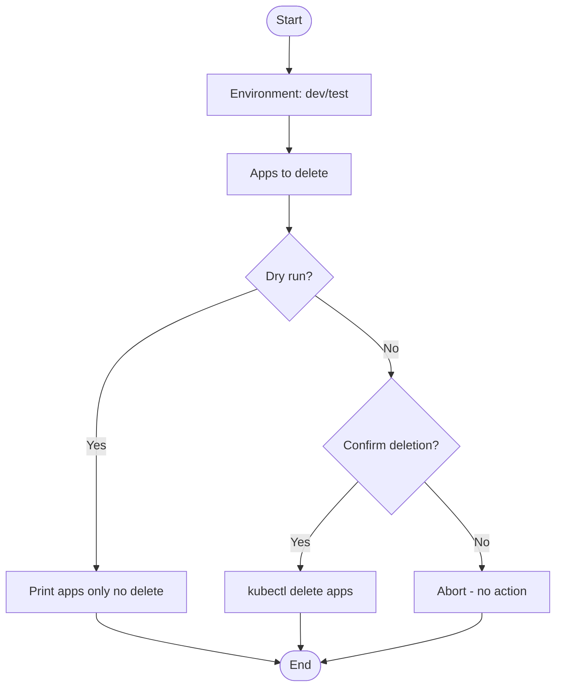
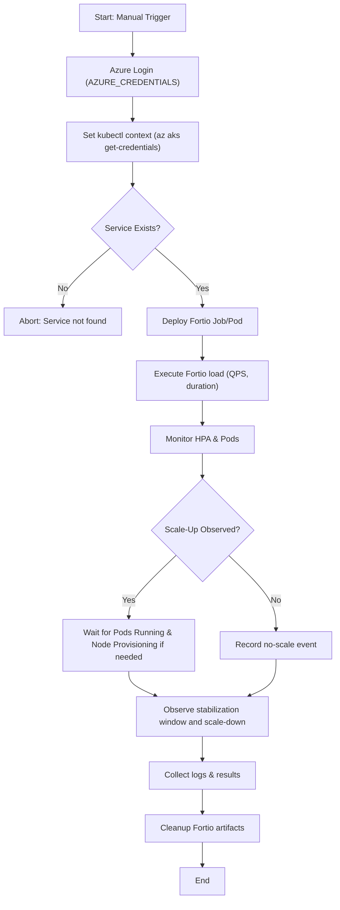

# 🚀 Kubernetes Deployment Guide (DEPLOYMENT.md)

This guide explains **how deployment works in all parameter combinations**, mapping workflow inputs to actual cluster operations.

---

## 🔹 Case 1: Security Scan Only
- Parameters: `run_security_scan=true`, `run_terraform=false`, `run_application_deployment=false`
- Steps:
  1. Checkout repo
  2. Run container/IaC scans
- No infra or apps deployed

---

## 🔹 Case 2: Terraform Only
- Parameters: `run_security_scan=false`, `run_terraform=true`, `run_application_deployment=false`
- Steps:
  1. Checkout repo
  2. Azure login (`AZURE_CREDENTIALS`)
  3. Setup Terraform
  4. Run `terraform <action>`
     - If `action=apply` → Creates **AKS cluster + ACR + VNet + Log Analytics**
     - If `action=destroy` → Deletes all infra
     - If `action=refresh` → Updates state only
- Apps are **not deployed**

---

## 🔹 Case 3: Application Deployment Only
- Parameters: `run_security_scan=false`, `run_terraform=false`, `run_application_deployment=true`
- Steps:
  1. Checkout repo
  2. Azure login (`AZURE_CREDENTIALS`)
  3. Set kubectl context (`az aks get-credentials`)
  4. Deploy apps with `kubectl apply -f manifests/`:
     - Node.js App
     - NGINX
     - k8sGPT (provider from `provider` input)
- Infra must already exist

---

## 🔹 Case 4: Full Deployment (Infra + Apps)
- Parameters: `run_security_scan=false`, `run_terraform=true`, `run_application_deployment=true`, `action=apply`
- Steps:
  1. Azure login (`AZURE_CREDENTIALS`)
  2. Terraform provisions **AKS + ACR + VNet + Log Analytics**
  3. Set kubectl context (`az aks get-credentials`)
  4. Kubectl deploys applications
- Result: Complete environment ready

---

## 🔹 Case 5: Destroy Mode
- Parameters: `action=destroy`, `run_terraform=true`
- Steps:
  1. Azure login (`AZURE_CREDENTIALS`)
  2. Terraform deletes AKS + networking + ACR + monitoring
  3. Apps removed automatically when infra is destroyed

---

## 🔹 Case 6: Refresh Mode
- Parameters: `action=refresh`, `run_terraform=true`
- Steps:
  1. Azure login (`AZURE_CREDENTIALS`)
  2. Terraform refreshes state
  3. No changes to infra or apps

---

## 🔹 Case 7: Mixed Mode (Custom)
- Example: `run_security_scan=true`, `run_terraform=true`, `run_application_deployment=true`
- Steps:
  1. Run scans
  2. Azure login (`AZURE_CREDENTIALS`)
  3. Provision infra with Terraform
  4. Set kubectl context (`az aks get-credentials`)
  5. Deploy apps

---

## 📄 Deletion Workflow Cases

- **Dry Run**: `dry_run=true` → Prints apps to be deleted
- **Confirmed Delete**: `dry_run=false`, `confirm=true` → Deletes apps with `kubectl delete`
- **Invalid**: `confirm=false` → No deletion happens

---

## ✅ Summary

| Mode | Security Scan | Terraform | App Deploy | Effect |
|------|---------------|-----------|------------|--------|
| Case 1 | ✅ | ❌ | ❌ | Scans only |
| Case 2 | ❌ | ✅ | ❌ | Infra only |
| Case 3 | ❌ | ❌ | ✅ | Apps only |
| Case 4 | ❌ | ✅ | ✅ | Full deploy |
| Case 5 | ❌ | ✅ (destroy) | ❌ | Destroy infra |
| Case 6 | ❌ | ✅ (refresh) | ❌ | Refresh state |
| Case 7 | ✅ | ✅ | ✅ | Scan + Infra + Apps |

---

## 📊 Visual Decision Flows (Mermaid)

### Deployment Workflow (Mermaid)

```mermaid
flowchart TD
    A[Start] --> B[Environment: dev/test]
    B --> C{Run Security Scan?}
    C -- Yes --> D[Perform Security Scans]
    D --> E{Run Terraform?}
    C -- No --> E{Run Terraform?}

    E -- No --> H{Deploy Applications?}
    E -- Yes --> F{Terraform Action?}

    F -- apply --> F1[Azure Login -> Terraform APPLY (AKS + ACR + VNet + Log Analytics)]
    F -- refresh --> F2[Azure Login -> Terraform REFRESH - state sync]
    F -- destroy --> F3[Azure Login -> Terraform DESTROY - delete infra]

    F1 --> G[Set kubectl context via az aks get-credentials]
    F2 --> H
    F3 --> H

    H -- Yes --> I{k8sGPT Provider? - google/openai}
    H -- No --> Z[End]

    I --> J[Deploy Apps: Node.js, NGINX, k8sGPT]
    J --> Z[End]
```

### Delete Workflow (Mermaid)



### HPA Fortio Stress Test Workflow (Mermaid)



---

## 🔎 Workflow Explanations

### 1. Deployment Workflow (Detailed Explanation)
The deployment workflow is the **main entrypoint** for provisioning infrastructure and deploying apps.  
It supports all parameter combinations (`run_security_scan`, `run_terraform`, `run_application_deployment`, `action`).  

- **Inputs**: environment, action (apply/destroy/refresh), flags for scan/deploy.  
- **Infra provisioning**: Terraform creates AKS, ACR, VNet, Log Analytics.  
- **App deployment**: kubectl applies manifests for Node.js, NGINX, k8sGPT.  
- **Mixed mode**: allows combining security scan + infra + apps.  

**Outcome**: An environment (dev/test) is ready with infra + apps as requested.

---

### 2. Delete Workflow (Detailed Explanation)
The delete workflow safely handles app removal.  

- **Inputs**: `dry_run`, `confirm`.  
- **Modes**:  
  - Dry Run: Lists apps that would be deleted.  
  - Confirmed: Deletes apps with `kubectl delete`.  
  - Invalid: No action if confirm is false.  

**Outcome**: Prevents accidental deletions while allowing explicit cleanup.

---

### 3. HPA Fortio Stress Test Workflow (Detailed Explanation)
This workflow runs **Fortio load tests** to validate Horizontal Pod Autoscaler (HPA) on AKS.  

- **Inputs**: cluster_name, resource_group, namespace, service_name, service_port, qps, load_duration_seconds.  
- **Steps**: Azure login, set kubectl context, ensure service exists, deploy Fortio, run load, observe HPA scaling, collect results.  
- **Interpreting results**: observe scale-up under load, node provisioning, scale-down after stabilization.  
- **Cleanup**: removes Fortio pods automatically.  

**Outcome**: Validates HPA scaling rules and cluster autoscaler behavior under controlled load.

---

## 📑 Documentation Navigation

- [README.md](../README.md) – Root project overview  
- [DOCUMENTATION.md](./DOCUMENTATION.md) – General documentation and explanations  
- [DEPLOYMENT.md](./DEPLOYMENT.md) – Deployment workflow and parameter guide  
- [WORKFLOW_DETAILED.md](./WORKFLOW_DETAILED.md) – Detailed workflow explanation  
- [TERRAFORM_DETAILED.md](./TERRAFORM_DETAILED.md) – Terraform provisioning deep dive  
- [KUBERNETES_DETAILED.md](./KUBERNETES_DETAILED.md) – Kubernetes application deployment  
- [GITHUBACTIONS_DETAILED.md](./GITHUBACTIONS_DETAILED.md) – GitHub Actions automation  
- [DELETE_WORKFLOW_DETAILED.md](./DELETE_WORKFLOW_DETAILED.md) – Safe deletion workflow  
- [BEST_PRACTICES.md](./BEST_PRACTICES.md) – Security, scalability, and governance  
- [HANDBOOK.md](./HANDBOOK.md) – Combined handbook (all docs in one)  

🔗 Extras:  
- [HANDBOOK.html](./HANDBOOK.html) – Web-friendly version  
- [HANDBOOK_QUICKSTART.pdf](./HANDBOOK_QUICKSTART.pdf) – Quickstart summary (2–3 pages)  
- [HANDBOOK_CHEATSHEET.pdf](./HANDBOOK_CHEATSHEET.pdf) – 1-page cheatsheet  
- [HANDBOOK_CHEATSHEET_GRAPHICAL.pdf](./HANDBOOK_CHEATSHEET_GRAPHICAL.pdf) – Visual cheatsheet with diagram  
- [HANDBOOK_FULL_PRESENTATION.pptx](./HANDBOOK_FULL_PRESENTATION.pptx) – Technical slide deck  
- [HANDBOOK_EXECUTIVE_PRESENTATION.pptx](./HANDBOOK_EXECUTIVE_PRESENTATION.pptx) – Executive-friendly deck  

---
