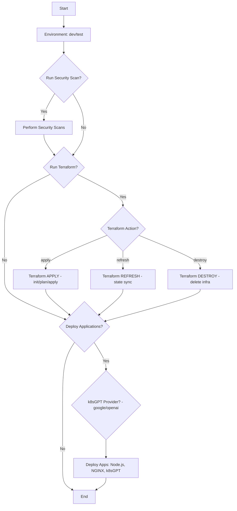

# 🚀 Kubernetes Deployment Guide (DEPLOYMENT.md)

This guide explains **how deployment works in all parameter combinations**, mapping workflow inputs to actual cluster operations.

---

## 🔹 Case 1: Security Scan Only
- Parameters: `run_security_scan=true`, `run_terraform=false`, `run_application_deployment=false`
- Steps:
  1. Checkout repo
  2. Run container/IaC scans
- No infra or apps deployed

---

## 🔹 Case 2: Terraform Only
- Parameters: `run_security_scan=false`, `run_terraform=true`, `run_application_deployment=false`
- Steps:
  1. Checkout repo
  2. Setup Terraform
  3. Run `terraform <action>`
     - If `action=apply` → Creates cluster + networking
     - If `action=destroy` → Deletes all infra
     - If `action=refresh` → Updates state only
- Apps are **not deployed**

---

## 🔹 Case 3: Application Deployment Only
- Parameters: `run_security_scan=false`, `run_terraform=false`, `run_application_deployment=true`
- Steps:
  1. Checkout repo
  2. Setup kubectl (auth against cluster)
  3. Deploy apps with `kubectl apply -f manifests/`:
     - Node.js App
     - NGINX
     - k8sGPT (provider from `provider` input)
- Infra must already exist

---

## 🔹 Case 4: Full Deployment (Infra + Apps)
- Parameters: `run_security_scan=false`, `run_terraform=true`, `run_application_deployment=true`, `action=apply`
- Steps:
  1. Terraform creates cluster/networking
  2. Kubectl deploys applications
- Result: Complete environment ready

---

## 🔹 Case 5: Destroy Mode
- Parameters: `action=destroy`, `run_terraform=true`
- Steps:
  1. Terraform deletes cluster + networking
  2. Apps removed automatically when infra is destroyed

---

## 🔹 Case 6: Refresh Mode
- Parameters: `action=refresh`, `run_terraform=true`
- Steps:
  1. Terraform refreshes state
  2. No changes to infra or apps

---

## 🔹 Case 7: Mixed Mode (Custom)
- Example: `run_security_scan=true`, `run_terraform=true`, `run_application_deployment=true`
- Steps:
  1. Run scans
  2. Provision infra
  3. Deploy apps

---

## 📄 Deletion Workflow Cases

- **Dry Run**: `dry_run=true` → Prints apps to be deleted
- **Confirmed Delete**: `dry_run=false`, `confirm=true` → Deletes apps with `kubectl delete`
- **Invalid**: `confirm=false` → No deletion happens

---

## ✅ Summary

| Mode | Security Scan | Terraform | App Deploy | Effect |
|------|---------------|-----------|------------|--------|
| Case 1 | ✅ | ❌ | ❌ | Scans only |
| Case 2 | ❌ | ✅ | ❌ | Infra only |
| Case 3 | ❌ | ❌ | ✅ | Apps only |
| Case 4 | ❌ | ✅ | ✅ | Full deploy |
| Case 5 | ❌ | ✅ (destroy) | ❌ | Destroy infra |
| Case 6 | ❌ | ✅ (refresh) | ❌ | Refresh state |
| Case 7 | ✅ | ✅ | ✅ | Scan + Infra + Apps |

---

## 📊 Visual Decision Flows (Mermaid)

> These render natively on GitHub. If you view this in a tool that doesn't support Mermaid, copy the blocks below into a GitHub Markdown file.

### Deployment Workflow (Detailed)

### Delete Workflow (Detailed)

---

## 📊 Visual Decision Flows (Mermaid)

### Deployment Workflow (Detailed)

### Delete Workflow (Detailed)

---

## 📊 Visual Decision Flows (Mermaid)

### Deployment Workflow (Detailed)

### Delete Workflow (Detailed)

---

## 📊 Visual Decision Flows (Mermaid)

### Deployment Workflow (Detailed)

### Delete Workflow (Detailed)

---

## 📑 Documentation Navigation

- [README.md](../README.md) – Root project overview  
- [DOCUMENTATION.md](./DOCUMENTATION.md) – General documentation and explanations  
- [DEPLOYMENT.md](./DEPLOYMENT.md) – Deployment workflow and parameter guide  
- [WORKFLOW_DETAILED.md](./WORKFLOW_DETAILED.md) – Detailed workflow explanation (~400 lines)  
- [TERRAFORM_DETAILED.md](./TERRAFORM_DETAILED.md) – Terraform provisioning deep dive (~400 lines)  
- [KUBERNETES_DETAILED.md](./KUBERNETES_DETAILED.md) – Kubernetes application deployment (~400 lines)  
- [GITHUBACTIONS_DETAILED.md](./GITHUBACTIONS_DETAILED.md) – GitHub Actions automation (~400 lines)  
- [DELETE_WORKFLOW_DETAILED.md](./DELETE_WORKFLOW_DETAILED.md) – Safe deletion workflow (~400 lines)  
- [BEST_PRACTICES.md](./BEST_PRACTICES.md) – Security, scalability, and governance (~400 lines)  
- [HANDBOOK.md](./HANDBOOK.md) – Combined handbook (all docs in one)  

🔗 Extras:  
- [HANDBOOK.html](./HANDBOOK.html) – Web-friendly version  
- [HANDBOOK_QUICKSTART.pdf](./HANDBOOK_QUICKSTART.pdf) – Quickstart summary (2–3 pages)  
- [HANDBOOK_CHEATSHEET.pdf](./HANDBOOK_CHEATSHEET.pdf) – 1-page cheatsheet  
- [HANDBOOK_CHEATSHEET_GRAPHICAL.pdf](./HANDBOOK_CHEATSHEET_GRAPHICAL.pdf) – Visual cheatsheet with diagram  
- [HANDBOOK_FULL_PRESENTATION.pptx](./HANDBOOK_FULL_PRESENTATION.pptx) – Technical slide deck  
- [HANDBOOK_EXECUTIVE_PRESENTATION.pptx](./HANDBOOK_EXECUTIVE_PRESENTATION.pptx) – Executive-friendly deck  

---
