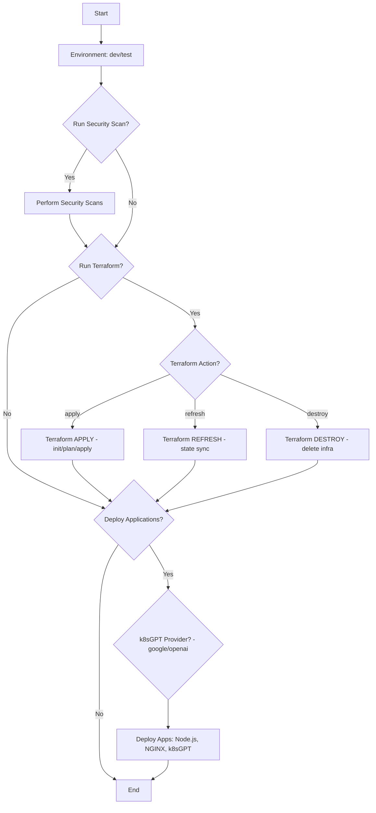
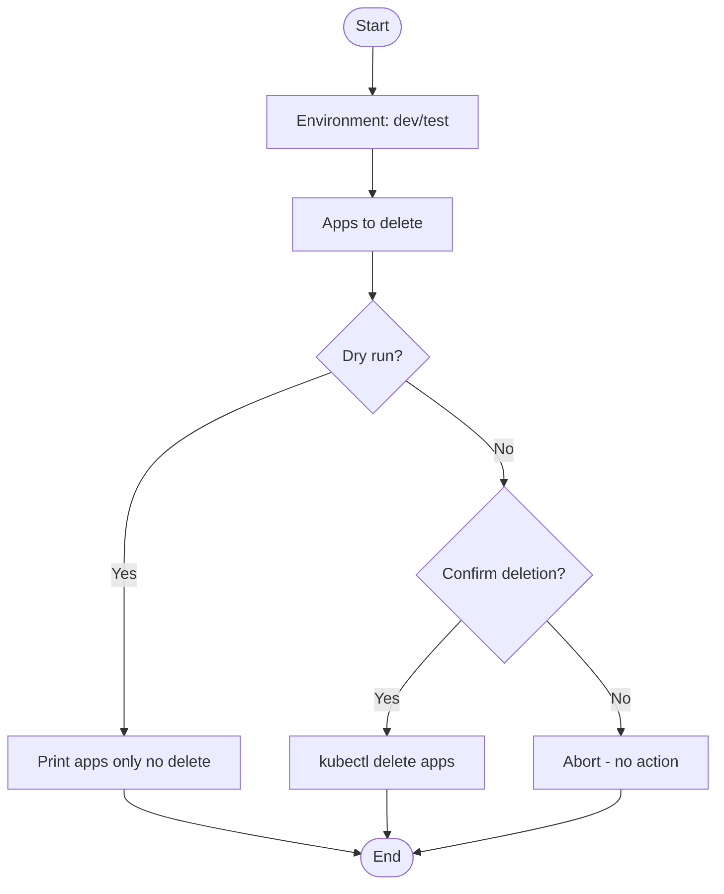

# One-Click K8s Deployment — Full Handbook

_Generated: 2025-08-29 09:53:42_

## Table of Contents
- [README.md](#readmemd)
- [DOCUMENTATION.md](#documentationmd)
- [DEPLOYMENT.md](#deploymentmd)
- [WORKFLOW_DETAILED.md](#workflow_detailedmd)
- [TERRAFORM_DETAILED.md](#terraform_detailedmd)
- [KUBERNETES_DETAILED.md](#kubernetes_detailedmd)
- [GITHUBACTIONS_DETAILED.md](#githubactions_detailedmd)
- [DELETE_WORKFLOW_DETAILED.md](#delete_workflow_detailedmd)
- [BEST_PRACTICES.md](#best_practicesmd)

# README.md

# Dynamic Reusable K8s Cluster with Networking + Apps + k8sGPT

Steps:

1. Customize terraform/terraform.tfvars
2. Build Node.js Docker image:
```bash
cd apps/nodejs-app
docker build -t <YOUR_DOCKER_USERNAME>/nodejs-app:latest .
docker push <YOUR_DOCKER_USERNAME>/nodejs-app:latest
```
3. Apply Terraform:
```bash
cd terraform
terraform init
terraform apply -auto-approve
```
4. Access:
- Node.js App: http://<node-public-lb-ip>:3000
- NGINX: http://<node-public-lb-ip>
- k8sGPT: http://<k8sgpt-lb-ip>


---

## 📘 Extended Project Overview

This repository is a **fully automated Kubernetes deployment solution** that combines:

- **Terraform** for provisioning cloud infrastructure (networking, cluster, nodes)
- **GitHub Actions** for CI/CD automation and parameterized workflows
- **Kubernetes** manifests and Helm for application deployment
- **Security Scans** integrated directly into the pipeline

### Key Workflows
- **One-Click K8s Deployment (`deploy-k8s.yml`)**
  - Provides parameterized infra + app deployments with granular control
- **Delete Applications (`delete-k8s-applications.yml`)**
  - Allows selective removal of apps from the cluster safely

### Supported Applications
- Node.js Web Application (served on LoadBalancer)
- NGINX Web Server
- k8sGPT (AI diagnostics using Google or OpenAI provider)

### Usage Flow
1. **Build and push app images** to DockerHub or your registry
2. **Run GitHub Action** with appropriate parameters (choose environment, action, provider, etc.)
3. **Access apps** via public LoadBalancer endpoints
4. **Optionally delete apps** via the controlled delete workflow

---

## 📊 Parameters and Variables

### Deployment Workflow Inputs
- **environment** → Target environment (`dev` / `test`)
- **action** → Terraform action (`apply`, `destroy`, `refresh`)
- **provider** → AI provider for k8sGPT (`google`, `openai`)
- **run_security_scan** → Boolean flag to run only security scans
- **run_terraform** → Boolean flag to enable infra provisioning
- **run_application_deployment** → Boolean flag to deploy Kubernetes apps

### Environment Variables & Secrets
- **DOCKER_USERNAME / DOCKER_PASSWORD** → For pulling/pushing container images
- **AWS_ACCESS_KEY_ID / AWS_SECRET_ACCESS_KEY** → For Terraform infra creation (AWS provider)

### Deletion Workflow Inputs
- **environment** → Target environment
- **dry_run** → Boolean, simulates deletions
- **apps_to_delete** → Comma-separated list of apps
- **confirm** → Must be `true` to allow actual deletion

---

## 📄 Extended Access Instructions

- **Node.js App**: `http://<node-lb-ip>:3000`
- **NGINX**: `http://<node-lb-ip>`
- **k8sGPT**: `http://<k8sgpt-lb-ip>`

---


# DOCUMENTATION.md

# 📘 One-Click Kubernetes Deployment Documentation

This repository provides a **parameter-driven, one-click deployment and management system** for Kubernetes clusters and applications using **GitHub Actions** and **Terraform**.

---

## 📂 Repository Structure (Relevant Parts)

- `.github/workflows/deploy-k8s.yml` → Deployment workflow (Terraform + Apps)
- `.github/workflows/delete-k8s-applications.yml` → Controlled deletion workflow
- `terraform/` → Terraform IaC definitions (infrastructure, cluster, apps)
- `apps/` → Application sources (Node.js, NGINX, k8sgpt, etc.)
- `README.md` → Basic usage guide

---

## 🚀 Deployment Workflow (`deploy-k8s.yml`)

This workflow is the **core one-click deployment pipeline**.  
It is **manually triggered** (`workflow_dispatch`) and accepts multiple **parameters** for fine-grained control.

### 🔹 Parameters

1. **`environment`**
   - Target environment for deployment
   - Options: `dev`, `test`
   - Example: `dev` (default)

2. **`action`**
   - Terraform action to perform
   - Options:
     - `apply` → Deploy infrastructure and apps
     - `destroy` → Tear down resources
     - `refresh` → Refresh Terraform state
   - Example: `apply` (default)

3. **`provider`**
   - AI provider for `k8sgpt`
   - Options: `google`, `openai`
   - Example: `google` (default)

4. **`run_security_scan`**
   - Boolean flag to only run security scans
   - Default: `false`
   - Example: `true` → skips infra/app deployment, runs only scans

5. **`run_terraform`**
   - Boolean flag to run Terraform infra provisioning
   - Default: `false`
   - Example: `true` → provisions infra without app deployment

6. **`run_application_deployment`**
   - Boolean flag to deploy Kubernetes applications (Node.js, NGINX, k8sgpt, etc.)
   - Default: `false`
   - Example: `true` → deploys apps if infra already exists

---

### ⚙️ Workflow Jobs

1. **Security Scan** (conditional)  
   - Runs only if `run_security_scan=true`
   - Performs container scanning, IaC security scans

2. **Terraform Deployment** (conditional)  
   - Runs if `run_terraform=true`
   - Executes `terraform init`, `terraform <action>` (apply/destroy/refresh)

3. **Application Deployment** (conditional)  
   - Runs if `run_application_deployment=true`
   - Uses `kubectl` to apply YAML manifests for apps
   - Deploys:
     - Node.js App (via LoadBalancer)
     - NGINX
     - k8sGPT (with selected provider)

---

## 🗑️ Deletion Workflow (`delete-k8s-applications.yml`)

This workflow allows **selective deletion of deployed apps** from the cluster.  
It is **manually triggered** and requires confirmation for safety.

### 🔹 Parameters

1. **`environment`**
   - Target environment (`dev`, `test`)

2. **`dry_run`**
   - Boolean
   - Default: `true`
   - Simulates deletions without applying them

3. **`apps_to_delete`**
   - Comma-separated list of applications
   - Example: `nodejs-app,nginx,k8sgpt-openai`

4. **`confirm`**
   - Must be `true` to actually delete
   - Acts as a safety switch

---

### ⚙️ Workflow Logic

- Reads the `apps_to_delete` input
- If `dry_run=true` → prints what would be deleted
- If `confirm=true` → runs `kubectl delete` commands for the selected apps
- Safeguard ensures **no accidental deletion** unless both conditions are met

---

## ✅ Key Advantages

- **Granular control**: Deploy/destroy/refresh per environment
- **Parameter-driven**: No code changes needed for switching providers/apps
- **Safe deletion**: `dry_run` and `confirm` safeguard
- **Multi-provider AI**: Supports both `Google` and `OpenAI` for `k8sgpt`
- **One-click simplicity**: Entire cluster + apps in a single workflow run


---

## 🔎 Detailed Explanation of Deployment Workflow

### Step-by-Step

1. **Trigger Workflow**
   - Triggered manually via GitHub Actions `workflow_dispatch`
   - User selects environment, action, and flags

2. **Security Scan Step**
   - Runs if `run_security_scan=true`
   - Scans IaC (Terraform), Dockerfiles, container images
   - No infra or app changes applied

3. **Terraform Step**
   - Runs if `run_terraform=true`
   - Commands executed:
     - `terraform init` → Initializes providers and modules
     - `terraform plan` → Shows infra changes
     - `terraform apply -auto-approve` → Provisions infra when action=apply
     - `terraform refresh` → Updates state from cloud
     - `terraform destroy -auto-approve` → Tears down infra

4. **Application Deployment Step**
   - Runs if `run_application_deployment=true`
   - Requires cluster kubeconfig
   - Applies manifests with `kubectl apply`
   - Deploys:
     - Node.js app (Deployment + Service + LoadBalancer)
     - NGINX ingress/web server
     - k8sGPT with selected provider

5. **Completion**
   - Workflow ends
   - Apps accessible via public IPs

---

## 🔧 Variables Explained

### `environment`
- Defines which environment Terraform variables will load (dev/test)
- Maps to specific `.tfvars` files

### `action`
- Controls Terraform lifecycle
- `apply` = Create/update infra
- `destroy` = Delete infra
- `refresh` = Sync Terraform state

### `provider`
- Sets AI provider for k8sGPT
- Injected into manifests as ENV var or Helm value

### `run_security_scan`
- If true, workflow short-circuits after scans

### `run_terraform`
- If true, runs Terraform block

### `run_application_deployment`
- If true, runs Kubernetes manifests deploy

---


# DEPLOYMENT.md

# 🚀 Kubernetes Deployment Guide (DEPLOYMENT.md)

This guide explains **how deployment works in all parameter combinations**, mapping workflow inputs to actual cluster operations.

---

## 🔹 Case 1: Security Scan Only
- Parameters: `run_security_scan=true`, `run_terraform=false`, `run_application_deployment=false`
- Steps:
  1. Checkout repo
  2. Run container/IaC scans
- No infra or apps deployed

---

## 🔹 Case 2: Terraform Only
- Parameters: `run_security_scan=false`, `run_terraform=true`, `run_application_deployment=false`
- Steps:
  1. Checkout repo
  2. Setup Terraform
  3. Run `terraform <action>`
     - If `action=apply` → Creates cluster + networking
     - If `action=destroy` → Deletes all infra
     - If `action=refresh` → Updates state only
- Apps are **not deployed**

---

## 🔹 Case 3: Application Deployment Only
- Parameters: `run_security_scan=false`, `run_terraform=false`, `run_application_deployment=true`
- Steps:
  1. Checkout repo
  2. Setup kubectl (auth against cluster)
  3. Deploy apps with `kubectl apply -f manifests/`:
     - Node.js App
     - NGINX
     - k8sGPT (provider from `provider` input)
- Infra must already exist

---

## 🔹 Case 4: Full Deployment (Infra + Apps)
- Parameters: `run_security_scan=false`, `run_terraform=true`, `run_application_deployment=true`, `action=apply`
- Steps:
  1. Terraform creates cluster/networking
  2. Kubectl deploys applications
- Result: Complete environment ready

---

## 🔹 Case 5: Destroy Mode
- Parameters: `action=destroy`, `run_terraform=true`
- Steps:
  1. Terraform deletes cluster + networking
  2. Apps removed automatically when infra is destroyed

---

## 🔹 Case 6: Refresh Mode
- Parameters: `action=refresh`, `run_terraform=true`
- Steps:
  1. Terraform refreshes state
  2. No changes to infra or apps

---

## 🔹 Case 7: Mixed Mode (Custom)
- Example: `run_security_scan=true`, `run_terraform=true`, `run_application_deployment=true`
- Steps:
  1. Run scans
  2. Provision infra
  3. Deploy apps

---

## 📄 Deletion Workflow Cases

- **Dry Run**: `dry_run=true` → Prints apps to be deleted
- **Confirmed Delete**: `dry_run=false`, `confirm=true` → Deletes apps with `kubectl delete`
- **Invalid**: `confirm=false` → No deletion happens

---

## ✅ Summary

| Mode | Security Scan | Terraform | App Deploy | Effect |
|------|---------------|-----------|------------|--------|
| Case 1 | ✅ | ❌ | ❌ | Scans only |
| Case 2 | ❌ | ✅ | ❌ | Infra only |
| Case 3 | ❌ | ❌ | ✅ | Apps only |
| Case 4 | ❌ | ✅ | ✅ | Full deploy |
| Case 5 | ❌ | ✅ (destroy) | ❌ | Destroy infra |
| Case 6 | ❌ | ✅ (refresh) | ❌ | Refresh state |
| Case 7 | ✅ | ✅ | ✅ | Scan + Infra + Apps |

---

## 📊 Visual Decision Flows (Mermaid)

> These render natively on GitHub. If you view this in a tool that doesn't support Mermaid, copy the blocks below into a GitHub Markdown file.

### Deployment Workflow (Detailed)


### Delete Workflow (Detailed)

---

## 📊 Visual Decision Flows (Mermaid)

### Deployment Workflow (Detailed)


### Delete Workflow (Detailed)


---

## 📊 Visual Decision Flows (Mermaid)

### Deployment Workflow (Detailed)


### Delete Workflow (Detailed)

---

## 📊 Visual Decision Flows (Mermaid)

### Deployment Workflow (Detailed)



### Delete Workflow (Detailed)




---

## 🔎 Expanded Deployment Case Explanations

### Case 1: Security Scan Only
- Parameters:
  - `run_security_scan=true`
  - `run_terraform=false`
  - `run_application_deployment=false`
- Effect:
  - Runs static/dynamic scans only
  - No infra/app deployment

### Case 2: Terraform Only
- Parameters:
  - `run_security_scan=false`
  - `run_terraform=true`
  - `run_application_deployment=false`
- Effect:
  - Provisions infra only
  - No apps deployed

### Case 3: Application Deployment Only
- Parameters:
  - `run_security_scan=false`
  - `run_terraform=false`
  - `run_application_deployment=true`
- Effect:
  - Assumes infra exists
  - Deploys apps to cluster

### Case 4: Full Deployment
- Parameters:
  - `run_security_scan=false`
  - `run_terraform=true`
  - `run_application_deployment=true`
  - `action=apply`
- Effect:
  - Full infra + app deploy

### Case 5: Destroy
- Parameters:
  - `action=destroy`
  - `run_terraform=true`
- Effect:
  - Deletes infra and apps

### Case 6: Refresh
- Parameters:
  - `action=refresh`
  - `run_terraform=true`
- Effect:
  - Updates state only

### Case 7: Mixed
- Parameters:
  - All true
- Effect:
  - Runs scans + infra + apps

---

## 🛠️ Step Mapping

| Step | Runs When | Details |
|------|-----------|---------|
| Security Scan | run_security_scan=true | Scans IaC, containers |
| Terraform Init/Plan | run_terraform=true | Prepares infra state |
| Terraform Apply | action=apply | Provisions infra |
| Terraform Refresh | action=refresh | Sync state |
| Terraform Destroy | action=destroy | Remove infra |
| App Deployment | run_application_deployment=true | Deploys Node.js, NGINX, k8sGPT |

---


# WORKFLOW_DETAILED.md

# 📖 Detailed Workflow Guide (Expanded Version)

## 1. Introduction

Modern software delivery pipelines demand speed, reproducibility, and safety. 
Traditional deployment methods often required manual steps, long runbooks, and human oversight, 
which increased the risk of misconfigurations, downtime, and security breaches. 
This repository exists to solve that problem by providing a **parameter-driven, one-click deployment workflow** 
that integrates Terraform for infrastructure, Kubernetes for application orchestration, and GitHub Actions for automation.

Instead of managing infrastructure provisioning and application deployment as two separate activities, 
this repository treats them as stages of the same workflow. With a single GitHub Action trigger, 
teams can create or destroy environments, deploy or remove applications, and even run security scans without touching any servers manually. 
This workflow reflects the DevSecOps philosophy: embedding security and compliance checks directly into the deployment pipeline 
while still giving teams granular control through parameters.

---

## 2. Repository Structure in Depth

Understanding the repository structure is key to appreciating how the workflow functions. 
Every folder and file has a purpose, and together they form the foundation of the one-click deployment system.

### `.github/workflows/deploy-k8s.yml`
This is the central automation file. It is a GitHub Actions workflow triggered manually via the `workflow_dispatch` event. 
Inside, it defines inputs (parameters), environment variables, and jobs for security scanning, Terraform provisioning, 
and Kubernetes application deployment. Conditional logic (`if:` statements) ensures that jobs only run when explicitly enabled by parameters.

### `.github/workflows/delete-k8s-applications.yml`
This workflow focuses on safe deletion of applications from the cluster. It is intentionally designed not to touch infrastructure. 
It includes a `dry_run` parameter that shows what would be deleted and a `confirm` parameter that ensures no accidental deletion happens.

### `terraform/`
This folder holds the Infrastructure-as-Code (IaC) definitions. It includes `.tf` files and `.tfvars` files that define cloud networking, 
Kubernetes cluster setup, node groups, and load balancers. By modifying tfvars, environments can be customized without changing code.

### `apps/`
This folder contains application source code and Dockerfiles. The included apps are:
- A Node.js web application,
- An NGINX server, and
- k8sGPT, a Kubernetes diagnostics tool that can be configured to use Google or OpenAI as a provider.

Each app is containerized and deployable to Kubernetes via manifests or Helm.

### Documentation Files
- `README.md`: Quick start and overview.  
- `DOCUMENTATION.md`: Reference-style documentation for parameters and workflows.  
- `DEPLOYMENT.md`: Case-based documentation with flowcharts.  
- `WORKFLOW_DETAILED.md`: This file, a book-length explanation of the workflow.  

---

## 3. Workflow Lifecycle Overview

The deployment lifecycle is parameter-driven. A single workflow can behave in multiple ways depending on the values chosen during execution.

1. **Security Scan Phase**  
   If enabled, this runs static analysis and vulnerability scans without touching infrastructure or applications.

2. **Terraform Phase**  
   If enabled, Terraform provisions infrastructure or tears it down depending on the action chosen (`apply`, `destroy`, `refresh`).

3. **Application Deployment Phase**  
   If enabled, Kubernetes manifests are applied to deploy the Node.js app, NGINX, and k8sGPT.

This lifecycle ensures flexibility: teams can run scans only, deploy infra only, deploy apps only, or perform full end-to-end deployment.

---

## 4. Security Scan Phase in Depth

Security scanning is a first-class citizen in this workflow. 
When the `run_security_scan` parameter is set to `true`, the workflow launches a dedicated job to analyze code and containers for risks.

### Why Security Scanning?
Security scans are essential because cloud infrastructure and container workloads are frequent targets of attacks. 
By scanning Terraform IaC files, Docker images, and Kubernetes manifests, the workflow catches misconfigurations or vulnerabilities before they reach production.

### Example of IaC Security Scan
```yaml
jobs:
  security-scan:
    if: ${{ github.event.inputs.run_security_scan == 'true' }}
    runs-on: ubuntu-latest
    steps:
      - name: Checkout Repo
        uses: actions/checkout@v3

      - name: Run Terraform Static Analysis
        run: terraform validate

      - name: Run Container Scan
        uses: aquasecurity/trivy-action@master
        with:
          image-ref: myapp:latest
```

### Example Output
A typical scan might highlight an outdated base image in a Dockerfile or an insecure setting in Terraform, such as an open security group. 
The workflow surfaces these findings directly in the GitHub Actions logs, making them visible to developers before any resources are touched.

### Short-Circuit Behavior
If `run_security_scan=true` and all other flags are false, the workflow terminates after scanning. 
This allows teams to run "scan-only" jobs as part of compliance audits without the risk of accidental deployments.

---

## 5. Terraform Phase in Depth

The Terraform phase is the backbone of infrastructure provisioning. When `run_terraform=true`, the workflow begins 
executing Terraform commands to either create, destroy, or refresh infrastructure depending on the chosen `action` parameter.

### Terraform Initialization

The workflow starts with `terraform init`. This downloads provider plugins (such as AWS), configures backends, 
and ensures the environment is ready for planning and applying.

```yaml
- name: Terraform Init
  run: terraform init
```

### Terraform Planning

If the action is `apply` or `destroy`, a `terraform plan` step is executed to show the changes that will happen. 
This plan acts as a safeguard, giving teams visibility before resources are created or destroyed.

```yaml
- name: Terraform Plan
  run: terraform plan -var-file=environments/${{ github.event.inputs.environment }}.tfvars
```

### Terraform Apply

When the action is `apply`, Terraform provisions the following resources:
- VPC and networking components,
- Subnets and routing tables,
- A managed Kubernetes cluster,
- Node pools,
- Load balancers for services.

```yaml
- name: Terraform Apply
  run: terraform apply -auto-approve -var-file=environments/${{ github.event.inputs.environment }}.tfvars
```

### Terraform Refresh

The `refresh` action updates Terraform state to reflect real-world resources without making changes. 
This is useful for detecting drift between Terraform state and actual infrastructure.

### Terraform Destroy

When `action=destroy`, Terraform tears down all provisioned resources. This ensures that developers can 
easily remove entire environments when they are no longer needed, optimizing costs.

```yaml
- name: Terraform Destroy
  run: terraform destroy -auto-approve -var-file=environments/${{ github.event.inputs.environment }}.tfvars
```

### Secrets and Authentication

Terraform requires cloud credentials. These are passed securely from GitHub Secrets:

- `AWS_ACCESS_KEY_ID`
- `AWS_SECRET_ACCESS_KEY`

This avoids hardcoding credentials in the repo.

---

## 6. Application Deployment Phase in Depth

When `run_application_deployment=true`, the workflow connects to the cluster and applies Kubernetes manifests.

### Kubernetes Authentication

Terraform outputs a kubeconfig file. The workflow uses this to authenticate kubectl:

```yaml
- name: Configure kubectl
  run: aws eks update-kubeconfig --name mycluster --region us-east-1
```

### Deploying Node.js App

The Node.js application is deployed with a Deployment and Service manifest:

```yaml
apiVersion: apps/v1
kind: Deployment
metadata:
  name: nodejs-app
spec:
  replicas: 2
  selector:
    matchLabels:
      app: nodejs
  template:
    metadata:
      labels:
        app: nodejs
    spec:
      containers:
      - name: nodejs
        image: mydockerhub/nodejs-app:latest
        ports:
        - containerPort: 3000
---
apiVersion: v1
kind: Service
metadata:
  name: nodejs-service
spec:
  type: LoadBalancer
  selector:
    app: nodejs
  ports:
  - port: 3000
    targetPort: 3000
```

This exposes the Node.js app at `http://<lb-ip>:3000`.

### Deploying NGINX

NGINX is deployed similarly and exposed via a LoadBalancer on port 80. This can serve static content or act as a reverse proxy.

### Deploying k8sGPT

k8sGPT is deployed as a Kubernetes service. The `provider` parameter (google/openai) is passed as an environment variable:

```yaml
env:
- name: PROVIDER
  value: ${{ github.event.inputs.provider }}
```

This allows runtime switching of diagnostic providers.

---

## 7. End-to-End Deployment Case Studies

### Case: Full Deployment
Parameters:
- `environment=dev`
- `action=apply`
- `provider=google`
- `run_security_scan=false`
- `run_terraform=true`
- `run_application_deployment=true`

Flow:
1. Workflow starts, skips security scan.
2. Terraform provisions a dev cluster.
3. kubectl deploys Node.js, NGINX, and k8sGPT with Google provider.
4. Apps accessible via LoadBalancer IPs.

### Case: Scan Only
Parameters:
- `run_security_scan=true`
- all others false

Flow:
1. Workflow scans Terraform, Dockerfiles, and manifests.
2. Stops after reporting vulnerabilities.
3. No infra or apps are deployed.

### Case: Destroy
Parameters:
- `action=destroy`
- `run_terraform=true`

Flow:
1. Terraform tears down all infra.
2. Applications and load balancers are removed automatically.

---

## 8. Error Handling and Safety

Error handling is built in at every step.

- **Terraform Errors**: If tfvars are invalid or cloud quotas are exceeded, Terraform fails. Workflow halts.  
- **kubectl Errors**: If manifests are invalid, kubectl fails. Workflow halts before deploying further apps.  
- **Deletion Workflow Safety**: Requires both `dry_run=false` and `confirm=true` to actually delete apps.  
- **Short-Circuiting**: If a step fails, downstream steps are skipped.  

This ensures safety in production environments.

---

## 9. Security Philosophy

Security is embedded across the pipeline:

- **Shift Left**: Scans run before infra or apps are touched.  
- **Secrets Management**: Credentials stored in GitHub Secrets.  
- **Principle of Least Privilege**: Terraform credentials scoped narrowly.  
- **Safe Deletions**: Double confirmation needed.  

This philosophy ensures compliance with DevSecOps best practices.

---

## 10. Conclusion

The workflow in this repository represents a **modern, flexible, and safe approach** to Kubernetes deployments. 
It unifies infrastructure provisioning, application deployment, and security scanning into a single parameter-driven workflow. 
By leveraging Terraform, Kubernetes, and GitHub Actions together, it ensures reproducibility, auditability, and speed. 
Teams can confidently deploy, update, scan, or destroy environments with a single click, 
while maintaining guardrails against accidental misconfigurations or security oversights.

This document has explained the workflow in detail, from repository structure to case studies. 
In practice, the result is a system that reduces operational overhead, increases developer productivity, 
and strengthens the security posture of any organization using it.

---


# TERRAFORM_DETAILED.md

# 🌍 Terraform Detailed Guide (Expanded Version)

## 1. Introduction

Terraform is the foundation of infrastructure provisioning in this repository. 
It brings the principle of "infrastructure as code" (IaC) into practice, enabling teams to define, version, and reproduce 
cloud environments in a consistent and auditable way. Without Terraform, developers would have to rely on manual console 
operations or ad-hoc scripts, which are error-prone and non-reproducible.

The decision to use Terraform here is intentional. It allows the repository to remain cloud-agnostic at a conceptual level 
while still leveraging the AWS provider for real deployments. This separation of infrastructure from applications means 
that Kubernetes clusters, networking, and load balancers can be created or destroyed with a single workflow execution.

---

## 2. Philosophy of Terraform in This Repository

Terraform is more than just a provisioning tool; it is a control mechanism that defines **what exists** in the cloud and ensures 
that the current state matches the desired state. The philosophy followed here includes:

- **Declarative Infrastructure**: Resources are defined in `.tf` files and applied consistently across environments.  
- **Parameterization with tfvars**: Each environment (dev, test, prod) has its own `.tfvars` file, ensuring separation of concerns.  
- **Automation via GitHub Actions**: Terraform is invoked automatically through workflows, eliminating manual steps.  
- **Safety through Planning**: Every apply is preceded by a plan, giving visibility into changes.  
- **Reversibility**: Infrastructure can be destroyed just as easily as it can be created.  

---

## 3. Terraform Integration with the Workflow

Terraform is conditionally executed when the GitHub Actions workflow input `run_terraform` is set to true. 
The specific action Terraform performs is controlled by the `action` input (`apply`, `destroy`, or `refresh`).

### Example Workflow Snippet

```yaml
jobs:
  terraform:
    if: ${{ github.event.inputs.run_terraform == 'true' }}
    runs-on: ubuntu-latest
    steps:
      - name: Checkout
        uses: actions/checkout@v3

      - name: Setup Terraform
        uses: hashicorp/setup-terraform@v2

      - name: Terraform Init
        run: terraform init

      - name: Terraform Plan
        run: terraform plan -var-file=environments/${{ github.event.inputs.environment }}.tfvars

      - name: Terraform Apply
        if: ${{ github.event.inputs.action == 'apply' }}
        run: terraform apply -auto-approve -var-file=environments/${{ github.event.inputs.environment }}.tfvars

      - name: Terraform Destroy
        if: ${{ github.event.inputs.action == 'destroy' }}
        run: terraform destroy -auto-approve -var-file=environments/${{ github.event.inputs.environment }}.tfvars

      - name: Terraform Refresh
        if: ${{ github.event.inputs.action == 'refresh' }}
        run: terraform refresh -var-file=environments/${{ github.event.inputs.environment }}.tfvars
```

This snippet illustrates how Terraform is integrated directly into the workflow, tied to the parameters that users choose.

---

## 4. Terraform Commands in Depth

### `terraform init`
This command sets up the working directory, downloads provider plugins, and configures remote backends. 
It is the first step required before any plan or apply.

### `terraform plan`
The plan phase calculates the actions Terraform will take to reconcile the desired state with the current state. 
This is vital for visibility. In a GitHub Actions run, the plan output is visible in the logs, giving reviewers confidence 
before apply is executed.

### `terraform apply`
The apply phase provisions resources. In this repository, it creates networking components, a Kubernetes cluster, 
node pools, and load balancers. The `-auto-approve` flag is used in automation to skip manual confirmation.

### `terraform refresh`
This synchronizes Terraform state with real-world resources. If a resource has been modified outside Terraform, 
refresh updates the state file to reflect reality. This helps detect drift.

### `terraform destroy`
The destroy command tears down resources. It is useful for cost management, allowing temporary environments 
to be created and destroyed as needed.

---

## 5. Environment Variables and tfvars

Terraform is driven by `.tfvars` files that define values for variables. Each environment has its own tfvars file:

- `dev.tfvars`
- `test.tfvars`
- `prod.tfvars`

### Example `dev.tfvars`

```hcl
region = "us-east-1"
cluster_name = "dev-cluster"
node_count = 2
node_instance_type = "t3.medium"
```

This configuration ensures that the dev environment is small and cost-efficient, while test or prod tfvars 
can scale up resources.

By parameterizing environments, teams ensure that clusters do not interfere with each other and can be tuned individually.

---

## 6. State Management and Drift Handling

Terraform maintains a state file that records the resources it manages. 
In automation, this state is typically stored remotely to allow collaboration and prevent corruption. 
While this repository defaults to local state for simplicity, production deployments are recommended 
to use remote state (e.g., S3 with DynamoDB locking).

### Why Remote State?

- Collaboration: Multiple developers can work on the same infrastructure without overwriting each other’s state.  
- Safety: DynamoDB locking prevents concurrent applies.  
- Auditability: Remote state is versioned and recoverable.  

### Drift Detection

When resources are modified outside Terraform (e.g., manually changing a security group in AWS), drift occurs. 
Running `terraform refresh` or `terraform plan` reveals drift by comparing real-world resources with the state file. 
This ensures that Terraform remains the source of truth.

---


## 7. AWS Resources Provisioned

When `terraform apply` is executed, the following AWS resources are typically created in this repository’s context:

- **VPC (Virtual Private Cloud)**  
  Defines the isolated network where Kubernetes nodes and services run.

- **Subnets**  
  Public and private subnets spread across availability zones for resilience.

- **Internet Gateway and NAT Gateway**  
  Allow outbound internet access for nodes while securing internal traffic.

- **Security Groups**  
  Define ingress and egress rules for cluster communication and external access.

- **EKS Cluster (or equivalent)**  
  Managed Kubernetes control plane that hosts workloads.

- **Node Groups**  
  Worker nodes that run pods. Instance size and count are defined in tfvars.

- **Load Balancers**  
  Expose Node.js, NGINX, and k8sGPT applications externally.

Each resource is explicitly defined and linked, ensuring predictable environments.

---

## 8. Secrets and Authentication

Terraform requires cloud credentials to perform provisioning. These are never stored in code. Instead, GitHub Secrets 
are used:

- `AWS_ACCESS_KEY_ID`
- `AWS_SECRET_ACCESS_KEY`

These values are injected at runtime. The workflow ensures that secrets are masked in logs, preventing accidental exposure.

```yaml
env:
  AWS_ACCESS_KEY_ID: ${{ secrets.AWS_ACCESS_KEY_ID }}
  AWS_SECRET_ACCESS_KEY: ${{ secrets.AWS_SECRET_ACCESS_KEY }}
```

This design follows best practices for secret management in CI/CD pipelines.

---

## 9. Error Handling in Terraform

Errors can arise from many sources: invalid tfvars, quota limits, or AWS service issues. The workflow addresses these 
scenarios through visibility and fail-fast behavior.

### Example: Invalid tfvars
If a developer sets `node_instance_type = "invalid.type"`, Terraform plan fails immediately. Logs in the workflow show the error.

### Example: Quota Exceeded
If too many load balancers are already allocated in a region, Terraform apply will fail. Developers must either increase quotas 
or adjust resources.

### Example: Network Conflicts
If a VPC CIDR overlaps with an existing network, Terraform plan will highlight conflicts before applying.

This feedback loop ensures errors are caught early, and environments are not left half-deployed.

---

## 10. Case Studies

### Case: Apply
A developer triggers the workflow with:
- `environment=dev`
- `action=apply`
- `run_terraform=true`

Result: Terraform provisions a dev cluster, networking, and load balancers.

### Case: Destroy
Parameters:
- `environment=dev`
- `action=destroy`
- `run_terraform=true`

Result: Terraform tears down all resources, freeing costs and cleaning up networks.

### Case: Refresh
Parameters:
- `environment=test`
- `action=refresh`
- `run_terraform=true`

Result: Terraform syncs state with actual AWS resources, identifying drift without making changes.

---

## 11. Best Practices for Terraform in CI/CD

- **Use Remote State**: Store state in S3 with DynamoDB locking to enable safe collaboration.  
- **Modularize Code**: Break Terraform into reusable modules for VPC, EKS, and Node Groups.  
- **Version Providers**: Pin provider versions in `.tf` files to prevent unexpected upgrades.  
- **Validate Early**: Run `terraform validate` as part of security scans.  
- **Use Small Environments**: Keep dev/test clusters lightweight to optimize costs.  
- **Destroy Unused Resources**: Use `action=destroy` for temporary environments.  

---

## 12. Future Improvements

The Terraform implementation here can evolve with:

- **Policy as Code**: Integrate Sentinel or OPA to enforce compliance.  
- **Helm Provider**: Deploy Kubernetes apps directly from Terraform using Helm charts.  
- **Cost Estimation**: Integrate Infracost to show financial impact before apply.  
- **More Environments**: Expand tfvars for staging, performance, and production.  
- **Multi-Cloud Readiness**: Adapt providers for GCP or Azure.  

---

## 13. Conclusion

Terraform in this repository provides the **infrastructure backbone** for Kubernetes deployments. 
By combining declarative IaC with automation through GitHub Actions, teams achieve reliable, repeatable, 
and auditable provisioning of cloud environments.

The use of tfvars ensures environment isolation, while state management guarantees consistency. 
Error handling mechanisms prevent broken deployments, and secrets management secures credentials. 
Through apply, destroy, and refresh actions, infrastructure can be controlled with precision.

In practice, this Terraform setup empowers teams to spin up dev or test clusters within minutes, 
tear them down when not needed, and ensure that production clusters remain stable and drift-free.

This detailed guide has explained not only **what Terraform does in this repo**, but also **how and why it does it**, 
illustrating the broader DevOps philosophy of automation, safety, and reproducibility.

---


# KUBERNETES_DETAILED.md

# ☸️ Kubernetes Detailed Guide (Expanded Version)

## 1. Introduction

Kubernetes is the execution environment for all applications in this repository. 
While Terraform provisions the underlying infrastructure, Kubernetes is the layer where workloads run, scale, and self-heal. 
It provides the abstraction that allows containerized applications to be deployed uniformly across environments, regardless of the 
underlying infrastructure.

This repository leverages Kubernetes for three main workloads:
- A Node.js web application,
- An NGINX server, and
- k8sGPT, a diagnostic tool for Kubernetes clusters with AI provider integration.

Each workload is packaged into Kubernetes manifests (Deployments, Services, and supporting resources), making the system flexible, 
scalable, and easily extensible.

---

## 2. Kubernetes Cluster Overview

The cluster is provisioned by Terraform, typically through AWS EKS. Once the control plane and worker nodes are created, 
GitHub Actions connects to the cluster using a kubeconfig file. At this point, Kubernetes becomes the orchestration engine 
for deploying applications.

The cluster architecture includes:
- **Control Plane**: Managed by the cloud provider (EKS).  
- **Worker Nodes**: Provisioned in node groups defined by tfvars.  
- **Networking**: VPC and subnets configured by Terraform.  
- **Load Balancers**: Created dynamically by Kubernetes Services of type `LoadBalancer`.  

This design ensures that applications deployed to the cluster are immediately reachable from outside.

---

## 3. Node.js Application Deployment

The Node.js application demonstrates how a simple containerized workload can be deployed and scaled in Kubernetes. 
It is defined by a Deployment and a Service.

### Node.js Deployment Manifest

```yaml
apiVersion: apps/v1
kind: Deployment
metadata:
  name: nodejs-app
  labels:
    app: nodejs
spec:
  replicas: 2
  selector:
    matchLabels:
      app: nodejs
  template:
    metadata:
      labels:
        app: nodejs
    spec:
      containers:
      - name: nodejs
        image: mydockerhub/nodejs-app:latest
        ports:
        - containerPort: 3000
```

This deployment ensures that two replicas of the Node.js app are always running. 
If one pod crashes, Kubernetes automatically restarts it.

### Node.js Service Manifest

```yaml
apiVersion: v1
kind: Service
metadata:
  name: nodejs-service
spec:
  type: LoadBalancer
  selector:
    app: nodejs
  ports:
  - port: 3000
    targetPort: 3000
```

The `LoadBalancer` service type instructs Kubernetes to create a cloud load balancer. 
As a result, the Node.js application becomes accessible at `http://<load-balancer-ip>:3000`.

### Scaling the Node.js App

Replica count can be increased in the Deployment manifest or via:

```bash
kubectl scale deployment nodejs-app --replicas=5
```

Kubernetes schedules additional pods across nodes, and the service load balances requests automatically.

---

## 4. NGINX Deployment

NGINX serves as both a reverse proxy and a static file server. In this repository, it demonstrates deployment of a widely-used 
production-grade web server.

### NGINX Deployment Manifest

```yaml
apiVersion: apps/v1
kind: Deployment
metadata:
  name: nginx-deployment
  labels:
    app: nginx
spec:
  replicas: 2
  selector:
    matchLabels:
      app: nginx
  template:
    metadata:
      labels:
        app: nginx
    spec:
      containers:
      - name: nginx
        image: nginx:latest
        ports:
        - containerPort: 80
```

This ensures high availability for NGINX by running two replicas.

### NGINX Service Manifest

```yaml
apiVersion: v1
kind: Service
metadata:
  name: nginx-service
spec:
  type: LoadBalancer
  selector:
    app: nginx
  ports:
  - port: 80
    targetPort: 80
```

This service creates a public-facing load balancer, making NGINX accessible at `http://<load-balancer-ip>`.

### Use Cases

- Serving static content such as HTML or images.  
- Acting as a reverse proxy in front of other services.  
- Demonstrating ingress-style routing when extended.  

---

## 5. k8sGPT Deployment

k8sGPT is an AI-powered diagnostic tool for Kubernetes clusters. It inspects cluster state, identifies issues, 
and provides natural language explanations. In this repository, it is deployed as a Kubernetes workload that can be 
configured to use either Google or OpenAI as the provider.

### k8sGPT Deployment Manifest

```yaml
apiVersion: apps/v1
kind: Deployment
metadata:
  name: k8sgpt
  labels:
    app: k8sgpt
spec:
  replicas: 1
  selector:
    matchLabels:
      app: k8sgpt
  template:
    metadata:
      labels:
        app: k8sgpt
    spec:
      containers:
      - name: k8sgpt
        image: mydockerhub/k8sgpt:latest
        env:
        - name: PROVIDER
          value: "google" # or "openai"
        ports:
        - containerPort: 8080
```

### k8sGPT Service Manifest

```yaml
apiVersion: v1
kind: Service
metadata:
  name: k8sgpt-service
spec:
  type: LoadBalancer
  selector:
    app: k8sgpt
  ports:
  - port: 80
    targetPort: 8080
```

### Provider Switching

The `provider` parameter in the workflow determines whether Google or OpenAI is injected into the deployment as an environment variable:

```yaml
env:
- name: PROVIDER
  value: ${{ github.event.inputs.provider }}
```

This runtime configuration makes the system flexible without requiring manifest changes.

---

## 6. Service Types Explained

Kubernetes offers multiple service types, each serving a different purpose. 
This repository primarily uses `LoadBalancer` services, but understanding all service types provides context.

- **ClusterIP** (default): Exposes a service within the cluster only. Suitable for internal microservices.  
- **NodePort**: Exposes a service on a static port on each node. Often used for debugging or simple clusters.  
- **LoadBalancer**: Integrates with the cloud provider to create an external load balancer. This is used here to 
  expose Node.js, NGINX, and k8sGPT to the internet.  

By choosing `LoadBalancer`, the applications in this repository are immediately reachable from outside the cluster.

---

## 7. Namespaces and Labeling Strategy

Namespaces allow logical separation of resources. For example, dev and test apps can be deployed into different namespaces. 
In this repository, workloads are grouped under a common namespace per environment, ensuring isolation.

Labels are used extensively to connect Deployments and Services. For instance, both the Node.js Deployment and Service use `app: nodejs`. 
This label ensures the service routes traffic only to the intended pods.

---

## 8. ConfigMaps and Secrets

Applications often require configuration. Kubernetes supports two primitives:

- **ConfigMaps**: Store non-sensitive configuration such as environment variables or file contents.  
- **Secrets**: Store sensitive values such as API keys.  

Example of ConfigMap for Node.js app:

```yaml
apiVersion: v1
kind: ConfigMap
metadata:
  name: nodejs-config
data:
  APP_ENV: "development"
  LOG_LEVEL: "debug"
```

Example of Secret for k8sGPT:

```yaml
apiVersion: v1
kind: Secret
metadata:
  name: k8sgpt-secret
type: Opaque
data:
  API_KEY: bXktc2VjcmV0LWtleQ==  # base64 encoded
```

These are mounted into pods via environment variables or files.

---

## 9. Rolling Updates and Scaling

Kubernetes Deployments support rolling updates by default. 
When a new image is applied, pods are updated gradually, ensuring no downtime. 
If an error occurs, Kubernetes rolls back automatically.

Scaling can be manual (changing replicas) or automated using the Horizontal Pod Autoscaler (HPA). Example:

```bash
kubectl autoscale deployment nodejs-app --cpu-percent=50 --min=2 --max=10
```

This command ensures the Node.js app scales based on CPU usage.

---

## 10. Networking and Ingress

While LoadBalancer services provide external access, larger deployments benefit from ingress controllers. 
An ingress controller routes traffic based on hostnames and paths, enabling multiple apps to share one load balancer.

Example ingress rule:

```yaml
apiVersion: networking.k8s.io/v1
kind: Ingress
metadata:
  name: app-ingress
spec:
  rules:
  - host: node.dev.example.com
    http:
      paths:
      - path: /
        pathType: Prefix
        backend:
          service:
            name: nodejs-service
            port:
              number: 3000
```

Ingress controllers (NGINX Ingress, Traefik, etc.) can be added as future improvements to this repository.

---

## 11. Error Handling and Debugging

Deployments can fail for many reasons. Common issues include:

- **CrashLoopBackOff**: Application container repeatedly crashes due to misconfiguration.  
- **ImagePullBackOff**: Kubernetes cannot pull the container image (e.g., wrong DockerHub credentials).  
- **Pending Pods**: No nodes have enough resources.  

Debugging commands:

```bash
kubectl get pods
kubectl describe pod <pod-name>
kubectl logs <pod-name>
```

These reveal events, error messages, and application logs for troubleshooting.

---

## 12. Monitoring and Logging

Monitoring is essential in production environments. While not included by default in this repository, common practices include:

- **Prometheus & Grafana**: For metrics and dashboards.  
- **ELK (Elasticsearch, Logstash, Kibana)**: For centralized logging.  
- **Kubernetes Events**: Checked using `kubectl get events`.  

Integrating these tools can provide visibility into pod health, network traffic, and resource usage.

---

## 13. Case Studies

### Case: Node.js App Only
Parameters: `run_application_deployment=true`, manifests applied only for Node.js.  
Result: Cluster runs Node.js pods, accessible via a load balancer. NGINX and k8sGPT remain absent.

### Case: Full Stack Deployment
All applications deployed. Node.js serves dynamic content, NGINX provides static or reverse proxy capabilities, 
and k8sGPT provides diagnostics.

### Case: Provider Switch
Deploying k8sGPT with `provider=openai` instead of `google`.  
Result: Same diagnostic tool, different backend provider, no manifest changes required.

---

## 14. Security Practices

Security is vital in Kubernetes clusters. Recommendations include:

- **RBAC (Role-Based Access Control)**: Limit permissions for service accounts.  
- **Resource Quotas**: Prevent one app from consuming all resources.  
- **Network Policies**: Restrict pod-to-pod communication.  
- **Admission Controllers**: Enforce policies on pod creation.  
- **Pod Security Standards or OPA Gatekeeper**: Prevent privileged containers.  

By adopting these, the cluster remains secure even as workloads grow.

---

## 15. Conclusion

Kubernetes provides the orchestration needed to run applications reliably and securely. 
In this repository, Node.js, NGINX, and k8sGPT are deployed using straightforward manifests, 
but the principles extend to complex microservices architectures.

By using Deployments, Services, ConfigMaps, Secrets, and LoadBalancers, the repository demonstrates the essentials of Kubernetes. 
Scaling, rolling updates, and provider flexibility make the system robust. With added monitoring, ingress, and RBAC policies, 
the cluster can evolve into a production-grade environment.

This guide has explained Kubernetes in this repository in detail, showing not just *what* is deployed, 
but *how* and *why*. It equips teams to extend the setup, troubleshoot effectively, and adopt best practices.

---


# GITHUBACTIONS_DETAILED.md

# ⚙️ GitHub Actions Detailed Guide (Expanded Version)

## 1. Introduction

GitHub Actions is the automation backbone of this repository. It provides the continuous integration and delivery (CI/CD) 
engine that ties together Terraform and Kubernetes into a single, parameter-driven pipeline. Without GitHub Actions, 
developers would need to run Terraform and kubectl commands locally, which is inconsistent and prone to human error.

By embedding automation into workflows, the repository achieves:
- **Reproducibility**: The same workflow runs identically every time.  
- **Auditability**: Every workflow run is logged and linked to the commit that triggered it.  
- **Safety**: Parameters, conditionals, and secrets ensure safe operations.  
- **Flexibility**: A single workflow supports multiple use cases (scan, infra only, apps only, full deploy).  

---

## 2. Anatomy of a GitHub Actions Workflow

A workflow is a YAML file stored in `.github/workflows/`. It consists of:

- **Triggers**: Define when the workflow runs (manual, push, pull request, schedule).  
- **Jobs**: Logical groups of steps that run on virtual machines.  
- **Steps**: Individual commands or reusable actions executed sequentially.  
- **Conditionals**: `if:` expressions that control when jobs or steps run.  
- **Secrets and Variables**: Injected at runtime for authentication or configuration.  

### Example Structure

```yaml
name: Deploy K8s

on:
  workflow_dispatch:
    inputs:
      environment:
        description: "Target environment"
        required: true
        default: "dev"
      action:
        description: "Terraform action (apply/destroy/refresh)"
        required: true
        default: "apply"
      run_security_scan:
        description: "Run security scan?"
        required: true
        default: "false"
```

This snippet shows how the workflow is parameterized with `workflow_dispatch` inputs, enabling manual control.

---

## 3. deploy-k8s.yml Deep Dive

The `deploy-k8s.yml` workflow is the heart of the automation. It is designed to run in different modes depending on user input.

### Workflow Inputs

- **environment**: Chooses environment (dev/test).  
- **action**: Chooses Terraform lifecycle action (apply/destroy/refresh).  
- **provider**: Chooses AI provider for k8sGPT (google/openai).  
- **run_security_scan**: Boolean to run security scans.  
- **run_terraform**: Boolean to enable Terraform provisioning.  
- **run_application_deployment**: Boolean to enable Kubernetes application deployment.  

These inputs allow one workflow to serve many purposes.

---

### Security Scan Job

This job runs only when `run_security_scan=true`. It validates Terraform and scans container images for vulnerabilities.

```yaml
jobs:
  security-scan:
    if: ${{ github.event.inputs.run_security_scan == 'true' }}
    runs-on: ubuntu-latest
    steps:
      - name: Checkout Repository
        uses: actions/checkout@v3

      - name: Terraform Validate
        run: terraform validate

      - name: Container Scan
        uses: aquasecurity/trivy-action@master
        with:
          image-ref: myapp:latest
```

This ensures issues are caught early before infrastructure or apps are deployed.

---

### Terraform Job

The Terraform job is conditional on `run_terraform=true`. It executes `init`, `plan`, and then the action (`apply`, `destroy`, `refresh`).

```yaml
jobs:
  terraform:
    if: ${{ github.event.inputs.run_terraform == 'true' }}
    runs-on: ubuntu-latest
    steps:
      - name: Checkout Repository
        uses: actions/checkout@v3

      - name: Setup Terraform
        uses: hashicorp/setup-terraform@v2

      - name: Terraform Init
        run: terraform init

      - name: Terraform Plan
        run: terraform plan -var-file=environments/${{ github.event.inputs.environment }}.tfvars

      - name: Terraform Apply
        if: ${{ github.event.inputs.action == 'apply' }}
        run: terraform apply -auto-approve -var-file=environments/${{ github.event.inputs.environment }}.tfvars

      - name: Terraform Destroy
        if: ${{ github.event.inputs.action == 'destroy' }}
        run: terraform destroy -auto-approve -var-file=environments/${{ github.event.inputs.environment }}.tfvars

      - name: Terraform Refresh
        if: ${{ github.event.inputs.action == 'refresh' }}
        run: terraform refresh -var-file=environments/${{ github.event.inputs.environment }}.tfvars
```

The job ensures reproducibility and safety by always running `init` and `plan` before applying or destroying.

---

### Application Deployment Job

This job runs when `run_application_deployment=true`. It configures kubectl and applies manifests for the apps.

```yaml
jobs:
  deploy-apps:
    if: ${{ github.event.inputs.run_application_deployment == 'true' }}
    runs-on: ubuntu-latest
    steps:
      - name: Configure kubectl
        run: aws eks update-kubeconfig --name mycluster --region us-east-1

      - name: Deploy Node.js App
        run: kubectl apply -f k8s/nodejs.yaml

      - name: Deploy NGINX
        run: kubectl apply -f k8s/nginx.yaml

      - name: Deploy k8sGPT
        run: kubectl apply -f k8s/k8sgpt-${{ github.event.inputs.provider }}.yaml
```

This step ties everything together by deploying apps after infra is ready.

---

## 4. delete-k8s-applications.yml Deep Dive

The `delete-k8s-applications.yml` workflow is a complementary workflow focused on safe application removal. 
Unlike the deployment workflow, it does not touch infrastructure. Its goal is to delete specific Kubernetes applications on demand.

### Workflow Inputs

- **environment**: Target environment (dev/test).  
- **apps_to_delete**: Comma-separated list of apps (e.g., `nodejs-app,nginx,k8sgpt`).  
- **dry_run**: If true, lists what would be deleted without performing deletion.  
- **confirm**: Must be explicitly set to true to allow deletion.  

### Safety Mechanisms

The workflow requires both `dry_run=false` and `confirm=true` to proceed with deletion. 
This two-step safeguard prevents accidental removal of critical workloads.

### Example Workflow Section

```yaml
jobs:
  delete:
    runs-on: ubuntu-latest
    steps:
      - name: Configure kubectl
        run: aws eks update-kubeconfig --name mycluster --region us-east-1

      - name: Dry Run
        if: ${{ github.event.inputs.dry_run == 'true' }}
        run: echo "Would delete apps: ${{ github.event.inputs.apps_to_delete }}"

      - name: Confirm and Delete
        if: ${{ github.event.inputs.dry_run == 'false' && github.event.inputs.confirm == 'true' }}
        run: |
          for app in $(echo "${{ github.event.inputs.apps_to_delete }}" | tr ',' ' '); do
            kubectl delete deployment $app || true
            kubectl delete service $app || true
          done
```

---

## 5. Secrets Management in GitHub Actions

Secrets are critical to secure workflows. This repository uses GitHub Secrets for:

- **AWS_ACCESS_KEY_ID** and **AWS_SECRET_ACCESS_KEY**: For Terraform and kubectl authentication.  
- **DOCKER_USERNAME** and **DOCKER_PASSWORD**: For pulling/pushing images.  

Secrets are injected into workflow environments at runtime and masked in logs. Example:

```yaml
env:
  AWS_ACCESS_KEY_ID: ${{ secrets.AWS_ACCESS_KEY_ID }}
  AWS_SECRET_ACCESS_KEY: ${{ secrets.AWS_SECRET_ACCESS_KEY }}
```

By centralizing secrets in GitHub, they are versioned, auditable, and protected from accidental leaks.

---

## 6. Conditionals and Parameter-Driven Design

A unique feature of these workflows is conditional execution. Jobs run only if their associated flags are set. 
This makes the pipeline flexible and efficient.

### Example Conditional

```yaml
if: ${{ github.event.inputs.run_application_deployment == 'true' }}
```

This ensures the deployment job is skipped unless explicitly requested.

### Benefits of Conditional Design

- Saves compute time and costs.  
- Reduces risk by skipping unnecessary jobs.  
- Allows one workflow to serve multiple purposes.  

---

## 7. Error Handling and Retry Strategies

Workflows fail-fast by default. If Terraform or kubectl encounters an error, the job halts, preventing downstream steps from running.

### Error Handling Practices

- **Terraform**: Errors logged with detailed messages (e.g., invalid tfvars, quota exceeded).  
- **kubectl**: Errors show pod status and events. Developers can re-run with corrected manifests.  
- **Deletion**: Uses `|| true` to avoid breaking if an app is already absent.  

### Retry Strategies

- Rerun failed workflows directly from the GitHub UI.  
- Use `continue-on-error: true` in non-critical steps (e.g., logging).  
- Implement retries with third-party actions if needed.  

---

## 8. Reusability and Optimization

### Reusable Actions

The workflows use both official actions (checkout, setup-terraform) and third-party actions (Trivy scan). 
These can be replaced or extended with custom composite actions.

### Matrix Strategy

Workflows can be extended with matrices to deploy multiple environments in parallel. Example:

```yaml
strategy:
  matrix:
    environment: [dev, test]
```

### Caching

To optimize performance, Terraform plugin directories or Docker layers can be cached between runs. Example:

```yaml
- name: Cache Terraform Plugins
  uses: actions/cache@v3
  with:
    path: ~/.terraform.d/plugin-cache
    key: ${{ runner.os }}-terraform-${{ hashFiles('**/*.tf') }}
```

---

## 9. Best Practices for GitHub Actions

- **Use Environment Protection Rules**: Require approvals before deploying to production.  
- **Limit Secrets Access**: Scope secrets to environments where they are needed.  
- **Pin Action Versions**: Use specific versions (`@v2`) instead of `@master`.  
- **Add Notifications**: Send Slack/Teams messages on workflow success/failure.  
- **Use Artifacts**: Save Terraform plans or kubectl logs for audit purposes.  

---

## 10. Case Studies

### Case: Scan Only
Inputs: `run_security_scan=true`, others false.  
Workflow runs Trivy and Terraform validate, then stops.

### Case: Infra Only
Inputs: `run_terraform=true`, `action=apply`.  
Workflow provisions infra but does not deploy apps.

### Case: Apps Only
Inputs: `run_application_deployment=true`.  
Workflow deploys apps onto an existing cluster.

### Case: Full Deploy
All flags true, `action=apply`.  
Workflow scans, provisions infra, and deploys apps.

---

## 11. Future Enhancements

Potential improvements include:

- **Reusable Workflows**: Split jobs into separate workflows that can be called with `workflow_call`.  
- **Policy Enforcement**: Add Open Policy Agent (OPA) checks for manifests.  
- **Cost Reporting**: Integrate with Infracost to show cost implications of Terraform plans.  
- **Dynamic Previews**: Spin up ephemeral environments for pull requests.  
- **Observability Integration**: Automatically deploy Prometheus and Grafana dashboards.  

---

## 12. Conclusion

GitHub Actions in this repository provides the glue that binds Terraform and Kubernetes into a cohesive pipeline. 
It enables developers to deploy infrastructure, applications, and even run security scans with a single click. 
By using parameter-driven design, the workflows remain flexible and reusable. Safety features like conditionals, dry runs, 
and confirmations protect against mistakes.

With best practices applied—such as secret management, environment protection, and caching—these workflows 
can scale to production-grade environments. Future enhancements like reusable workflows and observability integrations 
can further strengthen the pipeline.

In short, GitHub Actions transforms this repository into a **self-service deployment system** for Kubernetes, 
bringing speed, safety, and simplicity to DevOps teams.

---


# DELETE_WORKFLOW_DETAILED.md

# 🗑️ Delete Workflow Detailed Guide (Expanded Version)

## 1. Introduction

In most deployment systems, deletion is either an afterthought or tied directly to infrastructure teardown. 
However, this repository deliberately separates application deletion from infrastructure destruction. 
The reason is simple: **safe, controlled, and auditable deletions**.

Applications deployed into Kubernetes may need to be removed independently of the cluster itself. 
For example, a development team may want to test removing the Node.js app while keeping NGINX and k8sGPT running. 
Or a security team may require removing k8sGPT temporarily without impacting other workloads. 
By creating a dedicated workflow for deletions, this repository ensures fine-grained control over application lifecycles.

---

## 2. Philosophy of Safety-First Deletion

Deletion is one of the most dangerous operations in DevOps. A single wrong command can take down production workloads, 
delete customer-facing apps, or break dependencies. This workflow applies the philosophy of **safety-first deletion** 
using three layers of protection:

1. **Explicit Environment Selection**: Users must specify which environment (dev, test) is targeted.  
2. **Dry Run Mode**: Users can simulate deletions to see what *would* happen without actually removing apps.  
3. **Confirmation Requirement**: Even if `dry_run=false`, the workflow does nothing unless `confirm=true`.  

This design ensures that accidental deletions are virtually impossible. 
Only when the user deliberately sets both flags (`dry_run=false` and `confirm=true`) will actual deletions occur.

---

## 3. Anatomy of the Workflow

The `delete-k8s-applications.yml` workflow is stored in `.github/workflows/`. 
It defines inputs, runs on a manual trigger, and executes deletion commands with conditional checks.

### Workflow Inputs

```yaml
on:
  workflow_dispatch:
    inputs:
      environment:
        description: "Target environment (dev/test)"
        required: true
      apps_to_delete:
        description: "Comma-separated list of apps to delete"
        required: true
      dry_run:
        description: "Simulate deletions without performing them"
        default: "true"
      confirm:
        description: "Must be set to true to actually delete apps"
        default: "false"
```

This input design emphasizes clarity: no deletions can occur unless a developer provides all required information.

### Workflow Jobs

The workflow consists of a single job with multiple steps:

1. **Configure kubectl**: Connects to the cluster for the specified environment.  
2. **Dry Run Step**: If `dry_run=true`, prints which apps *would* be deleted.  
3. **Confirm Step**: If `confirm=false`, aborts with a safety message.  
4. **Deletion Step**: If both conditions are met, executes `kubectl delete`.  

This sequence ensures transparency and control.

---

## 4. Parameters in Detail

### `environment`
Defines which cluster context is used. By separating dev and test environments, the workflow prevents accidental cross-environment deletions. 
For example, removing apps from dev does not affect test.

### `apps_to_delete`
Accepts a comma-separated list of apps. Example:  
```text
nodejs-app,nginx,k8sgpt
```
This flexibility allows partial deletions. A developer may delete only the Node.js app while leaving the others untouched.

### `dry_run`
A boolean-like input (true/false). When set to true, the workflow simulates deletions by printing the app names instead of deleting them. 
This mode is essential for audits and planning.

### `confirm`
The final safeguard. Even if dry_run=false, no deletions happen unless `confirm=true`. This requires explicit intent from the user.

---

## 5. Command Breakdown

The deletion commands are simple but effective:

```yaml
- name: Confirm and Delete
  if: ${{ github.event.inputs.dry_run == 'false' && github.event.inputs.confirm == 'true' }}
  run: |
    for app in $(echo "${{ github.event.inputs.apps_to_delete }}" | tr ',' ' '); do
      kubectl delete deployment $app || true
      kubectl delete service $app || true
    done
```

### Explanation

- The `for app in ...` loop iterates over each app provided.  
- `kubectl delete deployment $app` removes the app’s deployment.  
- `kubectl delete service $app` removes the associated service.  
- The `|| true` ensures the workflow does not fail if a resource does not exist.  

### Example Run

If `apps_to_delete=nodejs-app,nginx` and both conditions are met, the workflow executes:

```bash
kubectl delete deployment nodejs-app
kubectl delete service nodejs-app
kubectl delete deployment nginx
kubectl delete service nginx
```

This results in Node.js and NGINX being safely removed from the cluster.

---

## 6. Error Handling in Deletions

Deletion operations may encounter errors. Common scenarios include:

- **Non-Existent Applications**: If a developer specifies an app name that does not exist in the cluster, `kubectl delete` 
  returns an error. The `|| true` ensures the workflow logs the issue but continues execution.  
- **Partial Deletions**: Sometimes, the Deployment may exist while the Service does not (or vice versa). The loop handles each 
  independently, ensuring partial resources are removed.  
- **Cluster Connection Errors**: If kubeconfig is not configured correctly, the workflow fails fast at the connection step.  
- **Permissions Issues**: If RBAC prevents deletion, the workflow surfaces a "forbidden" error, highlighting insufficient rights.  

These errors are not silent; they are visible in the GitHub Actions logs, allowing developers to take corrective action.

---

## 7. Rollback Considerations

Sometimes deletions are triggered by mistake, or an app must be restored quickly. Rollback is achieved by simply re-deploying 
the application manifests.

### Example: Re-Deploy Node.js

```bash
kubectl apply -f k8s/nodejs.yaml
```

Since manifests are version-controlled in the repository, rollback is deterministic and auditable. 
This aligns with GitOps principles, where the repository is the source of truth.

For future enhancements, the workflow can be extended to **archive manifests** before deletion. 
Archived manifests could then be re-applied automatically if rollback is required.

---

## 8. Case Studies

### Case: Dry Run Only
Inputs:  
- `apps_to_delete=nodejs-app,nginx`  
- `dry_run=true`  
- `confirm=false`  

Result: Workflow outputs:  
```
Would delete apps: nodejs-app nginx
```
No resources are removed.

---

### Case: Confirm Missing
Inputs:  
- `apps_to_delete=nodejs-app`  
- `dry_run=false`  
- `confirm=false`  

Result: Workflow halts with a safety message. Nothing is deleted. This prevents accidental deletions.  

---

### Case: Confirmed Delete
Inputs:  
- `apps_to_delete=k8sgpt`  
- `dry_run=false`  
- `confirm=true`  

Result: Workflow executes `kubectl delete` commands, removing k8sGPT’s Deployment and Service.  

---

## 9. Security Practices

Security is fundamental to the deletion workflow. Recommended practices include:

- **RBAC Restrictions**: Limit the service account used by GitHub Actions to only allow deleting specific namespaces.  
- **Audit Logs**: Ensure cluster audit logging is enabled to record all deletions.  
- **Namespace Isolation**: Deploy apps into separate namespaces (dev, test) to avoid cross-environment risks.  
- **Scoped Access**: Avoid giving GitHub Actions cluster-admin rights. Use the principle of least privilege.  
- **Confirmation Culture**: Reinforce the requirement that destructive operations require explicit intent.  

Together, these ensure deletions are safe, controlled, and traceable.

---

## 10. Future Improvements

While the deletion workflow is already safe, future enhancements could make it more powerful:

- **Archiving Manifests**: Automatically back up manifests before deletion.  
- **GitOps Pruning**: Use GitOps controllers like ArgoCD to prune workloads instead of direct kubectl deletes.  
- **Notifications**: Send Slack or email alerts when deletions occur.  
- **Approval Gates**: Require team lead approval for deletions in shared environments.  
- **Selective Resource Deletion**: Allow finer granularity, e.g., delete only Services but not Deployments.  

These features would make the workflow even more robust in production contexts.

---

## 11. Conclusion

The deletion workflow in this repository demonstrates how **safety and flexibility can coexist**. 
By separating deletion from deployment, providing dry runs, and requiring explicit confirmation, the workflow 
ensures that destructive actions are intentional, auditable, and recoverable.

Errors are surfaced clearly, rollbacks are straightforward through manifest re-application, and security 
practices like RBAC and audit logs provide guardrails. Case studies highlight how the workflow behaves in 
different scenarios, reinforcing its reliability.

Ultimately, this workflow embodies DevOps maturity: empowering developers to remove applications when needed, 
without sacrificing control or risking accidental production outages. With planned improvements like archiving 
and notifications, it can evolve into a gold-standard approach for Kubernetes app lifecycle management.

---


# BEST_PRACTICES.md

# ✅ Best Practices Guide (Expanded Version)

## 1. Introduction

Best practices are the cornerstone of operating any modern DevOps pipeline. 
This repository demonstrates a complete Kubernetes deployment system powered by Terraform and GitHub Actions, 
but technology alone does not guarantee success. The way the system is **used, secured, scaled, and extended** 
determines whether it thrives in real-world environments.

This guide captures best practices for security, scalability, extensibility, and cost optimization, 
ensuring that deployments remain robust, auditable, and efficient. By following these guidelines, 
teams can transform the repository from a working prototype into a production-grade deployment system.

---

## 2. Security Best Practices

Security should be embedded into every stage of the pipeline. From how secrets are stored to how workloads run in Kubernetes, 
security controls ensure that vulnerabilities do not compromise reliability.

### 2.1 Secrets Management

- **Use GitHub Secrets**: Store sensitive values such as `AWS_ACCESS_KEY_ID`, `AWS_SECRET_ACCESS_KEY`, `DOCKER_USERNAME`, 
  and `DOCKER_PASSWORD` in GitHub Secrets.  
- **Avoid Hardcoding**: Never place secrets directly in workflows, Terraform, or Kubernetes manifests.  
- **Rotate Regularly**: Rotate credentials periodically to reduce the blast radius of leaks.  
- **Mask Secrets**: GitHub masks secret values in logs by default; avoid echoing secrets to stdout.  

### 2.2 Role-Based Access Control (RBAC)

Kubernetes RBAC ensures that identities only have the permissions they need.  
- Create dedicated service accounts for workflows with the least privilege.  
- Limit permissions to specific namespaces.  
- Audit roles regularly to ensure they are not overly permissive.  

### 2.3 Image Scanning and Supply Chain Security

Container images are a common attack vector.  
- Use vulnerability scanners like **Trivy** or **Anchore**.  
- Pin image versions (e.g., `nginx:1.21.6`) instead of `latest`.  
- Sign images using tools like **Cosign** to prevent tampering.  
- Restrict registries from which the cluster pulls images.  

### 2.4 Cluster Hardening

- Disable anonymous API access.  
- Use network policies to limit pod-to-pod communication.  
- Run workloads as non-root users.  
- Enable Pod Security Standards (baseline or restricted).  
- Enable audit logging to record sensitive operations like deletions.  

By embedding these practices, the repository aligns with DevSecOps principles: 
**security is not a stage at the end, but a thread running through every step**.

---

## 3. Scalability Best Practices

As teams and workloads grow, scalability becomes critical. Both Terraform and Kubernetes provide mechanisms for scaling.

### 3.1 Environment Separation

Keep dev, test, and prod environments separate using tfvars.  
- `dev.tfvars`: Lightweight cluster for experimentation.  
- `test.tfvars`: Medium-sized cluster for QA and integration testing.  
- `prod.tfvars`: Production cluster with redundancy and high availability.  

This ensures workloads do not interfere with each other and resources scale appropriately.

### 3.2 Terraform Modularization

Monolithic Terraform configurations can become unmanageable.  
- Break down Terraform into modules: `network`, `eks-cluster`, `node-groups`, `apps`.  
- Reuse modules across environments.  
- Version modules to track changes over time.  

This modular approach makes scaling infrastructure much easier.

### 3.3 Kubernetes Scaling

Kubernetes provides built-in scaling capabilities.  
- **Replica Scaling**: Increase Deployment replicas for horizontal scaling.  
- **Horizontal Pod Autoscaler (HPA)**: Automatically scale pods based on CPU or memory usage.  
- **Cluster Autoscaler**: Automatically add/remove nodes based on workload demand.  

Example of HPA:

```bash
kubectl autoscale deployment nodejs-app --cpu-percent=60 --min=2 --max=10
```

This ensures the Node.js app dynamically scales during traffic spikes.

### 3.4 Load Balancing and Ingress

Instead of provisioning one LoadBalancer per service, consider an Ingress controller for scalability.  
This reduces costs and simplifies external access.  
NGINX Ingress or Traefik are popular choices that can route traffic to multiple apps from a single load balancer.

---

## 4. Extensibility Best Practices

A hallmark of a good deployment system is its ability to grow with the team’s needs. 
This repository is designed to be extensible, and there are several ways to extend it responsibly.

### 4.1 Adding New Applications

- Store application code in the `apps/` directory with dedicated Dockerfiles.  
- Add Kubernetes manifests under `k8s/` or use Helm charts for complex apps.  
- Update workflows to include new deployment steps.  

By following this pattern, new applications integrate seamlessly into the pipeline.

### 4.2 Helm and Operators

While plain manifests are simple, Helm charts provide templating and versioning.  
- Use Helm for apps with many configurable parameters.  
- Consider operators (e.g., Prometheus Operator) for managing complex systems.  

### 4.3 GitOps Adoption

Adopting GitOps tools like ArgoCD or Flux provides continuous delivery directly from Git repositories.  
This ensures the cluster state always matches the declared manifests.  
- Commit changes → ArgoCD syncs → Cluster updates automatically.  

### 4.4 Observability Integration

Observability is key to extensibility.  
- **Prometheus + Grafana**: Metrics and dashboards.  
- **ELK or EFK Stack**: Centralized logging.  
- **OpenTelemetry**: Tracing across distributed services.  

With observability, teams can safely extend the system without losing visibility.

---

## 5. Cost Optimization

Cloud resources cost money, and without controls, costs can spiral. These best practices keep expenses in check.

### 5.1 Auto-Scaling Nodes and Pods

Enable cluster autoscaler to add/remove nodes dynamically. Combine with HPA for pods.  
This ensures resources scale with demand rather than sitting idle.

### 5.2 Destroy Unused Environments

Use `action=destroy` in Terraform workflows to remove dev/test environments when not in use.  
Temporary environments can be spun up quickly, making this a cost-efficient strategy.

### 5.3 Spot and Reserved Instances

- Use **spot instances** for non-critical dev workloads.  
- Use **reserved instances** or **savings plans** for production to save long-term costs.  

### 5.4 Cost Monitoring

Integrate tools like **Infracost** to show cost implications of Terraform plans.  
Example: A pull request that adds a new node group can display an estimated $200/month cost.  

This brings financial awareness into engineering decisions.

---

## 6. Governance and Compliance

Enterprises require governance beyond technical deployment. Governance ensures compliance, accountability, and consistency.

### 6.1 Audit Trails

- GitHub logs workflow runs.  
- Terraform state changes are auditable.  
- Kubernetes audit logging records sensitive operations.  

Together, these provide end-to-end traceability.

### 6.2 Policy as Code

Use tools like **OPA (Open Policy Agent)**, **Kyverno**, or **HashiCorp Sentinel** to enforce policies automatically.  
Examples:  
- Disallow privileged pods.  
- Require resource requests/limits on all deployments.  
- Block usage of `latest` image tags.  

### 6.3 Approval Workflows

Protect production environments with required approvals.  
- Use GitHub’s environment protection rules.  
- Require manual approval before applying to prod.  

This balances agility with safety.

---

## 7. Case Studies

### 7.1 Secure Production Deployment
A production cluster uses RBAC restrictions, OPA policies, and requires approvals before deploy.  
Result: Safe, compliant, and controlled operations.

### 7.2 Cost-Optimized Development
A dev cluster runs on spot instances with autoscaling enabled.  
Result: Costs reduced by 70% without impacting productivity.

### 7.3 Extensible Staging Environment
Staging cluster integrates Prometheus and Grafana, enabling teams to monitor new apps before production.  
Result: Issues detected earlier, reducing risk in prod.

---

## 8. Future Improvements

This repository can evolve further with advanced practices:  
- **AI-Ops**: Use AI-driven monitoring to predict failures.  
- **Predictive Scaling**: Anticipate traffic spikes before they happen.  
- **Automated Compliance**: Continuous checks against policies.  
- **Multi-Cloud Expansion**: Support GCP and Azure alongside AWS.  
- **Self-Service Portals**: Developers request environments via a UI that triggers workflows.  

These improvements transform the repository into an enterprise-grade platform.

---

## 9. Conclusion

Best practices transform a working deployment system into a production-ready platform.  
By embedding security at every stage, ensuring scalability through modularization, extending responsibly with GitOps and observability, 
and optimizing costs with autoscaling and monitoring, teams ensure sustainability.

Governance practices like audit trails, policies, and approval workflows guarantee compliance and accountability.  
Case studies show how these practices deliver real-world value across environments.

Ultimately, this repository is not just about deploying Kubernetes apps—it is about doing so **securely, efficiently, and responsibly**.  
With continuous improvement, it can serve as a blueprint for modern DevOps practices in any organization.

---

## 📑 Documentation Navigation

- [README.md](../README.md) – Root project overview  
- [DOCUMENTATION.md](./DOCUMENTATION.md) – General documentation and explanations  
- [DEPLOYMENT.md](./DEPLOYMENT.md) – Deployment workflow and parameter guide  
- [WORKFLOW_DETAILED.md](./WORKFLOW_DETAILED.md) – Detailed workflow explanation (~400 lines)  
- [TERRAFORM_DETAILED.md](./TERRAFORM_DETAILED.md) – Terraform provisioning deep dive (~400 lines)  
- [KUBERNETES_DETAILED.md](./KUBERNETES_DETAILED.md) – Kubernetes application deployment (~400 lines)  
- [GITHUBACTIONS_DETAILED.md](./GITHUBACTIONS_DETAILED.md) – GitHub Actions automation (~400 lines)  
- [DELETE_WORKFLOW_DETAILED.md](./DELETE_WORKFLOW_DETAILED.md) – Safe deletion workflow (~400 lines)  
- [BEST_PRACTICES.md](./BEST_PRACTICES.md) – Security, scalability, and governance (~400 lines)  
- [HANDBOOK.md](./HANDBOOK.md) – Combined handbook (all docs in one)  

🔗 Extras:  
- [HANDBOOK.html](./HANDBOOK.html) – Web-friendly version  
- [HANDBOOK_QUICKSTART.pdf](./HANDBOOK_QUICKSTART.pdf) – Quickstart summary (2–3 pages)  
- [HANDBOOK_CHEATSHEET.pdf](./HANDBOOK_CHEATSHEET.pdf) – 1-page cheatsheet  
- [HANDBOOK_CHEATSHEET_GRAPHICAL.pdf](./HANDBOOK_CHEATSHEET_GRAPHICAL.pdf) – Visual cheatsheet with diagram  
- [HANDBOOK_FULL_PRESENTATION.pptx](./HANDBOOK_FULL_PRESENTATION.pptx) – Technical slide deck  
- [HANDBOOK_EXECUTIVE_PRESENTATION.pptx](./HANDBOOK_EXECUTIVE_PRESENTATION.pptx) – Executive-friendly deck  

---
