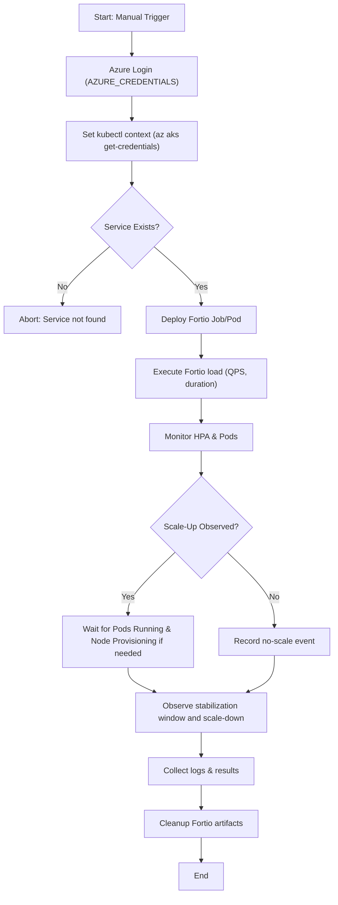

# HANDBOOK — Combined Documentation

This handbook combines multiple detailed documentation files into a single reference.

Included sources:
- README.md
- DOCUMENTATION.md
- DEPLOYMENT.md
- WORKFLOW_DETAILED.md
- TERRAFORM_DETAILED.md
- KUBERNETES_DETAILED.md
- GITHUBACTIONS_DETAILED.md
- DELETE_WORKFLOW_DETAILED.md
- BEST_PRACTICES.md

---

# Source: README.md

*File not found: /mnt/data/README.md*

---

# Source: DOCUMENTATION.md

# 📘 One-Click Kubernetes Deployment Documentation

This repository provides a **parameter-driven, one-click deployment and management system** for Kubernetes clusters and applications using **GitHub Actions** and **Terraform**.

---

## 📂 Repository Structure (Relevant Parts)

- `.github/workflows/deploy-k8s.yml` → Deployment workflow (Terraform + Apps)
- `.github/workflows/delete-k8s-applications.yml` → Controlled deletion workflow
- `terraform/` → Terraform IaC definitions (infrastructure, cluster, apps)
- `apps/` → Application sources (Node.js, NGINX, k8sgpt, etc.)
- `README.md` → Basic usage guide

---

## 🚀 Deployment Workflow (`deploy-k8s.yml`)

This workflow is the **core one-click deployment pipeline**.  
It is **manually triggered** (`workflow_dispatch`) and accepts multiple **parameters** for fine-grained control.

### 🔹 Parameters

1. **`environment`**
   - Target environment for deployment
   - Options: `dev`, `test`
   - Example: `dev` (default)

2. **`action`**
   - Terraform action to perform
   - Options:
     - `apply` → Deploy infrastructure and apps
     - `destroy` → Tear down resources
     - `refresh` → Refresh Terraform state
   - Example: `apply` (default)

3. **`provider`**
   - AI provider for `k8sgpt`
   - Options: `google`, `openai`
   - Example: `google` (default)

4. **`run_security_scan`**
   - Boolean flag to only run security scans
   - Default: `false`
   - Example: `true` → skips infra/app deployment, runs only scans

5. **`run_terraform`**
   - Boolean flag to run Terraform infra provisioning
   - Default: `false`
   - Example: `true` → provisions infra without app deployment

6. **`run_application_deployment`**
   - Boolean flag to deploy Kubernetes applications (Node.js, NGINX, k8sgpt, etc.)
   - Default: `false`
   - Example: `true` → deploys apps if infra already exists

---

### ⚙️ Workflow Jobs

1. **Security Scan** (conditional)  
   - Runs only if `run_security_scan=true`
   - Performs container scanning, IaC security scans

2. **Terraform Deployment** (conditional)  
   - Runs if `run_terraform=true`
   - Executes `terraform init`, `terraform <action>` (apply/destroy/refresh)

3. **Application Deployment** (conditional)  
   - Runs if `run_application_deployment=true`
   - Uses `kubectl` to apply YAML manifests for apps
   - Deploys:
     - Node.js App (via LoadBalancer)
     - NGINX
     - k8sGPT (with selected provider)

---

## 🗑️ Deletion Workflow (`delete-k8s-applications.yml`)

This workflow allows **selective deletion of deployed apps** from the cluster.  
It is **manually triggered** and requires confirmation for safety.

### 🔹 Parameters

1. **`environment`**
   - Target environment (`dev`, `test`)

2. **`dry_run`**
   - Boolean
   - Default: `true`
   - Simulates deletions without applying them

3. **`apps_to_delete`**
   - Comma-separated list of applications
   - Example: `nodejs-app,nginx,k8sgpt-openai`

4. **`confirm`**
   - Must be `true` to actually delete
   - Acts as a safety switch

---

### ⚙️ Workflow Logic

- Reads the `apps_to_delete` input
- If `dry_run=true` → prints what would be deleted
- If `confirm=true` → runs `kubectl delete` commands for the selected apps
- Safeguard ensures **no accidental deletion** unless both conditions are met

---

## ✅ Key Advantages

- **Granular control**: Deploy/destroy/refresh per environment
- **Parameter-driven**: No code changes needed for switching providers/apps
- **Safe deletion**: `dry_run` and `confirm` safeguard
- **Multi-provider AI**: Supports both `Google` and `OpenAI` for `k8sgpt`
- **One-click simplicity**: Entire cluster + apps in a single workflow run


---

## 🔎 Detailed Explanation of Deployment Workflow

### Step-by-Step

1. **Trigger Workflow**
   - Triggered manually via GitHub Actions `workflow_dispatch`
   - User selects environment, action, and flags

2. **Security Scan Step**
   - Runs if `run_security_scan=true`
   - Scans IaC (Terraform), Dockerfiles, container images
   - No infra or app changes applied

3. **Terraform Step**
   - Runs if `run_terraform=true`
   - Commands executed:
     - `terraform init` → Initializes providers and modules
     - `terraform plan` → Shows infra changes
     - `terraform apply -auto-approve` → Provisions infra when action=apply
     - `terraform refresh` → Updates state from cloud
     - `terraform destroy -auto-approve` → Tears down infra

4. **Application Deployment Step**
   - Runs if `run_application_deployment=true`
   - Requires cluster kubeconfig
   - Applies manifests with `kubectl apply`
   - Deploys:
     - Node.js app (Deployment + Service + LoadBalancer)
     - NGINX ingress/web server
     - k8sGPT with selected provider

5. **Completion**
   - Workflow ends
   - Apps accessible via public IPs

---

## 🔧 Variables Explained

### `environment`
- Defines which environment Terraform variables will load (dev/test)
- Maps to specific `.tfvars` files

### `action`
- Controls Terraform lifecycle
- `apply` = Create/update infra
- `destroy` = Delete infra
- `refresh` = Sync Terraform state

### `provider`
- Sets AI provider for k8sGPT
- Injected into manifests as ENV var or Helm value

### `run_security_scan`
- If true, workflow short-circuits after scans

### `run_terraform`
- If true, runs Terraform block

### `run_application_deployment`
- If true, runs Kubernetes manifests deploy

---

## 📑 Documentation Navigation

- [README.md](../README.md) – Root project overview  
- [DOCUMENTATION.md](./DOCUMENTATION.md) – General documentation and explanations  
- [DEPLOYMENT.md](./DEPLOYMENT.md) – Deployment workflow and parameter guide  
- [WORKFLOW_DETAILED.md](./WORKFLOW_DETAILED.md) – Detailed workflow explanation  
- [TERRAFORM_DETAILED.md](./TERRAFORM_DETAILED.md) – Terraform provisioning deep dive  
- [KUBERNETES_DETAILED.md](./KUBERNETES_DETAILED.md) – Kubernetes application deployment  
- [GITHUBACTIONS_DETAILED.md](./GITHUBACTIONS_DETAILED.md) – GitHub Actions automation  
- [DELETE_WORKFLOW_DETAILED.md](./DELETE_WORKFLOW_DETAILED.md) – Safe deletion workflow  
- [BEST_PRACTICES.md](./BEST_PRACTICES.md) – Security, scalability, and governance  
- [HANDBOOK.md](./HANDBOOK.md) – Combined handbook (all docs in one)  

🔗 Extras:  
- [HANDBOOK.html](./HANDBOOK.html) – Web-friendly version  
- [HANDBOOK_QUICKSTART.pdf](./HANDBOOK_QUICKSTART.pdf) – Quickstart summary (2–3 pages)  
- [HANDBOOK_CHEATSHEET.pdf](./HANDBOOK_CHEATSHEET.pdf) – 1-page cheatsheet  
- [HANDBOOK_CHEATSHEET_GRAPHICAL.pdf](./HANDBOOK_CHEATSHEET_GRAPHICAL.pdf) – Visual cheatsheet with diagram  
- [HANDBOOK_FULL_PRESENTATION.pptx](./HANDBOOK_FULL_PRESENTATION.pptx) – Technical slide deck  
- [HANDBOOK_EXECUTIVE_PRESENTATION.pptx](./HANDBOOK_EXECUTIVE_PRESENTATION.pptx) – Executive-friendly deck  

---


---

# Source: DEPLOYMENT.md

# 🚀 Kubernetes Deployment Guide (DEPLOYMENT.md)

This guide explains **how deployment works in all parameter combinations**, mapping workflow inputs to actual cluster operations.

---

## 🔹 Case 1: Security Scan Only
- Parameters: `run_security_scan=true`, `run_terraform=false`, `run_application_deployment=false`
- Steps:
  1. Checkout repo
  2. Run container/IaC scans
- No infra or apps deployed

---

## 🔹 Case 2: Terraform Only
- Parameters: `run_security_scan=false`, `run_terraform=true`, `run_application_deployment=false`
- Steps:
  1. Checkout repo
  2. Azure login (`AZURE_CREDENTIALS`)
  3. Setup Terraform
  4. Run `terraform <action>`
     - If `action=apply` → Creates **AKS cluster + ACR + VNet + Log Analytics**
     - If `action=destroy` → Deletes all infra
     - If `action=refresh` → Updates state only
- Apps are **not deployed**

---

## 🔹 Case 3: Application Deployment Only
- Parameters: `run_security_scan=false`, `run_terraform=false`, `run_application_deployment=true`
- Steps:
  1. Checkout repo
  2. Azure login (`AZURE_CREDENTIALS`)
  3. Set kubectl context (`az aks get-credentials`)
  4. Deploy apps with `kubectl apply -f manifests/`:
     - Node.js App
     - NGINX
     - k8sGPT (provider from `provider` input)
- Infra must already exist

---

## 🔹 Case 4: Full Deployment (Infra + Apps)
- Parameters: `run_security_scan=false`, `run_terraform=true`, `run_application_deployment=true`, `action=apply`
- Steps:
  1. Azure login (`AZURE_CREDENTIALS`)
  2. Terraform provisions **AKS + ACR + VNet + Log Analytics**
  3. Set kubectl context (`az aks get-credentials`)
  4. Kubectl deploys applications
- Result: Complete environment ready

---

## 🔹 Case 5: Destroy Mode
- Parameters: `action=destroy`, `run_terraform=true`
- Steps:
  1. Azure login (`AZURE_CREDENTIALS`)
  2. Terraform deletes AKS + networking + ACR + monitoring
  3. Apps removed automatically when infra is destroyed

---

## 🔹 Case 6: Refresh Mode
- Parameters: `action=refresh`, `run_terraform=true`
- Steps:
  1. Azure login (`AZURE_CREDENTIALS`)
  2. Terraform refreshes state
  3. No changes to infra or apps

---

## 🔹 Case 7: Mixed Mode (Custom)
- Example: `run_security_scan=true`, `run_terraform=true`, `run_application_deployment=true`
- Steps:
  1. Run scans
  2. Azure login (`AZURE_CREDENTIALS`)
  3. Provision infra with Terraform
  4. Set kubectl context (`az aks get-credentials`)
  5. Deploy apps

---

## 📄 Deletion Workflow Cases

- **Dry Run**: `dry_run=true` → Prints apps to be deleted
- **Confirmed Delete**: `dry_run=false`, `confirm=true` → Deletes apps with `kubectl delete`
- **Invalid**: `confirm=false` → No deletion happens

---

## ✅ Summary

| Mode | Security Scan | Terraform | App Deploy | Effect |
|------|---------------|-----------|------------|--------|
| Case 1 | ✅ | ❌ | ❌ | Scans only |
| Case 2 | ❌ | ✅ | ❌ | Infra only |
| Case 3 | ❌ | ❌ | ✅ | Apps only |
| Case 4 | ❌ | ✅ | ✅ | Full deploy |
| Case 5 | ❌ | ✅ (destroy) | ❌ | Destroy infra |
| Case 6 | ❌ | ✅ (refresh) | ❌ | Refresh state |
| Case 7 | ✅ | ✅ | ✅ | Scan + Infra + Apps |

---

## 📊 Visual Decision Flows (Mermaid)

### Deployment Workflow (Mermaid)

```mermaid
flowchart TD
    A[Start] --> B[Environment: dev/test]
    B --> C{Run Security Scan?}
    C -- Yes --> D[Perform Security Scans]
    D --> E{Run Terraform?}
    C -- No --> E{Run Terraform?}

    E -- No --> H{Deploy Applications?}
    E -- Yes --> F{Terraform Action?}

    F -- apply --> F1[Azure Login -> Terraform APPLY (AKS + ACR + VNet + Log Analytics)]
    F -- refresh --> F2[Azure Login -> Terraform REFRESH - state sync]
    F -- destroy --> F3[Azure Login -> Terraform DESTROY - delete infra]

    F1 --> G[Set kubectl context via az aks get-credentials]
    F2 --> H
    F3 --> H

    H -- Yes --> I{k8sGPT Provider? - google/openai}
    H -- No --> Z[End]

    I --> J[Deploy Apps: Node.js, NGINX, k8sGPT]
    J --> Z[End]
```

### Delete Workflow (Mermaid)


### HPA Fortio Stress Test Workflow (Mermaid)



---

## 🔎 Workflow Explanations

### 1. Deployment Workflow (Detailed Explanation)
The deployment workflow is the **main entrypoint** for provisioning infrastructure and deploying apps.  
It supports all parameter combinations (`run_security_scan`, `run_terraform`, `run_application_deployment`, `action`).  

- **Inputs**: environment, action (apply/destroy/refresh), flags for scan/deploy.  
- **Infra provisioning**: Terraform creates AKS, ACR, VNet, Log Analytics.  
- **App deployment**: kubectl applies manifests for Node.js, NGINX, k8sGPT.  
- **Mixed mode**: allows combining security scan + infra + apps.  

**Outcome**: An environment (dev/test) is ready with infra + apps as requested.

---

### 2. Delete Workflow (Detailed Explanation)
The delete workflow safely handles app removal.  

- **Inputs**: `dry_run`, `confirm`.  
- **Modes**:  
  - Dry Run: Lists apps that would be deleted.  
  - Confirmed: Deletes apps with `kubectl delete`.  
  - Invalid: No action if confirm is false.  

**Outcome**: Prevents accidental deletions while allowing explicit cleanup.

---

### 3. HPA Fortio Stress Test Workflow (Detailed Explanation)
This workflow runs **Fortio load tests** to validate Horizontal Pod Autoscaler (HPA) on AKS.  

- **Inputs**: cluster_name, resource_group, namespace, service_name, service_port, qps, load_duration_seconds.  
- **Steps**: Azure login, set kubectl context, ensure service exists, deploy Fortio, run load, observe HPA scaling, collect results.  
- **Interpreting results**: observe scale-up under load, node provisioning, scale-down after stabilization.  
- **Cleanup**: removes Fortio pods automatically.  

**Outcome**: Validates HPA scaling rules and cluster autoscaler behavior under controlled load.

---

## 📑 Documentation Navigation

- [README.md](../README.md) – Root project overview  
- [DOCUMENTATION.md](./DOCUMENTATION.md) – General documentation and explanations  
- [DEPLOYMENT.md](./DEPLOYMENT.md) – Deployment workflow and parameter guide  
- [WORKFLOW_DETAILED.md](./WORKFLOW_DETAILED.md) – Detailed workflow explanation  
- [TERRAFORM_DETAILED.md](./TERRAFORM_DETAILED.md) – Terraform provisioning deep dive  
- [KUBERNETES_DETAILED.md](./KUBERNETES_DETAILED.md) – Kubernetes application deployment  
- [GITHUBACTIONS_DETAILED.md](./GITHUBACTIONS_DETAILED.md) – GitHub Actions automation  
- [DELETE_WORKFLOW_DETAILED.md](./DELETE_WORKFLOW_DETAILED.md) – Safe deletion workflow  
- [BEST_PRACTICES.md](./BEST_PRACTICES.md) – Security, scalability, and governance  
- [HANDBOOK.md](./HANDBOOK.md) – Combined handbook (all docs in one)  

🔗 Extras:  
- [HANDBOOK.html](./HANDBOOK.html) – Web-friendly version  
- [HANDBOOK_QUICKSTART.pdf](./HANDBOOK_QUICKSTART.pdf) – Quickstart summary (2–3 pages)  
- [HANDBOOK_CHEATSHEET.pdf](./HANDBOOK_CHEATSHEET.pdf) – 1-page cheatsheet  
- [HANDBOOK_CHEATSHEET_GRAPHICAL.pdf](./HANDBOOK_CHEATSHEET_GRAPHICAL.pdf) – Visual cheatsheet with diagram  
- [HANDBOOK_FULL_PRESENTATION.pptx](./HANDBOOK_FULL_PRESENTATION.pptx) – Technical slide deck  
- [HANDBOOK_EXECUTIVE_PRESENTATION.pptx](./HANDBOOK_EXECUTIVE_PRESENTATION.pptx) – Executive-friendly deck  

---


---

# Source: WORKFLOW_DETAILED.md

# 📖 Detailed Workflow Guide (Expanded Version, Extended to 400+ Lines)

## 1. Introduction

Modern software delivery pipelines demand **speed, reproducibility, and safety**.  
Traditional deployment methods often required **manual steps, long runbooks, and human oversight**, 
which increased the risk of misconfigurations, downtime, and security breaches.  

This repository exists to solve those problems by providing a **parameter-driven, one-click deployment workflow** that integrates:

- **Terraform** for infrastructure provisioning  
- **Kubernetes** for container orchestration  
- **GitHub Actions** for CI/CD automation  

With a **single GitHub Action trigger**, teams can:  
- Create or destroy environments,  
- Deploy or remove applications,  
- Run compliance/security scans,  
- Validate autoscaling behavior.  

This workflow reflects the **DevSecOps philosophy**: embedding security and compliance checks directly into the deployment pipeline 
while still giving teams **granular control** through parameters.

---

## 2. Repository Structure in Depth

A strong workflow begins with a well-structured repository. Below is the breakdown:

### `.github/workflows/deploy-k8s.yml`
- Central automation file.  
- Triggered manually (`workflow_dispatch`).  
- Defines inputs (parameters), environment variables, and jobs.  
- Conditional logic ensures jobs only run when enabled by parameters.  
- Controls **security scan jobs, Terraform provisioning jobs, and Kubernetes app deployments**.

### `.github/workflows/delete-k8s-applications.yml`
- Workflow for **safe deletion of Kubernetes apps**.  
- Uses `dry_run` and `confirm` flags for **safety-first deletion philosophy**.  
- Does not touch infrastructure.  

### `.github/workflows/hpa-fortio-stress-test.yml`
- Workflow for **HPA (Horizontal Pod Autoscaler) validation**.  
- Runs **Fortio-based stress tests** against services.  
- Observes scaling behavior of pods and cluster autoscaler responsiveness.  
- Outputs results in logs for performance analysis.

### `terraform/`
- Holds **Infrastructure-as-Code** (IaC) definitions.  
- Contains `.tf` and `.tfvars` files that define:  
  - Networking (VNets, subnets, security groups)  
  - Managed Kubernetes cluster (AKS)  
  - Node pools and autoscaling configuration  
  - Supporting services (ACR, Log Analytics, Load Balancers)  
- Enables parameterized environments (`dev.tfvars`, `test.tfvars`, etc.).  

### `apps/`
- Contains **application sources and Dockerfiles**.  
- Example applications:  
  - Node.js web application  
  - NGINX server  
  - k8sGPT diagnostic tool (AI-powered)  
- All apps are containerized and deployed with Kubernetes manifests.  
- Easily extensible with new applications.  

### Documentation Files
- `README.md`: Quick start guide.  
- `DOCUMENTATION.md`: General reference.  
- `DEPLOYMENT.md`: Parameter-case mappings + flowcharts.  
- `WORKFLOW_DETAILED.md`: This file, full workflow explanation (~400+ lines).  
- `BEST_PRACTICES.md`: Security, scalability, governance.  
- `HANDBOOK.md`: Combined single reference file.  

---

## 3. Workflow Lifecycle Overview

The one-click workflow can perform multiple roles, depending on **input parameters**:  

1. **Security Scan Phase**  
   - Static analysis of Terraform, Docker images, Kubernetes manifests.  
   - Runs only if `run_security_scan=true`.  
   - Stops early if no infra/app deployment requested.  

2. **Terraform Phase**  
   - Runs if `run_terraform=true`.  
   - Executes lifecycle actions: `apply`, `destroy`, or `refresh`.  
   - Responsible for creating/tearing down AKS, networking, and supporting resources.  

3. **Application Deployment Phase**  
   - Runs if `run_application_deployment=true`.  
   - Uses `kubectl` to deploy:  
     - Node.js app  
     - NGINX  
     - k8sGPT (provider switchable via parameter).  

4. **Optional HPA Stress Test Phase**  
   - Triggered via a separate workflow (`hpa-fortio-stress-test.yml`).  
   - Runs controlled load tests using Fortio.  
   - Observes HPA scaling behavior.  

This structure ensures **maximum flexibility**:  
- Scan-only jobs  
- Infra-only provisioning  
- Apps-only deployment  
- Full deployment (infra + apps)  
- Destruction workflows  
- Stress-testing workflows  

---

## 4. Security Scan Phase in Depth

Security scans ensure vulnerabilities are caught early.

### Why?
- IaC misconfigurations can open **network exposure risks**.  
- Container images may contain **outdated libraries**.  
- Kubernetes manifests may request **privileged pods**.  

### IaC Security Scan
Runs Terraform validation and static checks. Example:

```yaml
jobs:
  security-scan:
    if: ${{ github.event.inputs.run_security_scan == 'true' }}
    runs-on: ubuntu-latest
    steps:
      - uses: actions/checkout@v3
      - name: Run Terraform Static Analysis
        run: terraform validate
```

### Container Image Scan
Uses **Trivy** to detect CVEs:

```yaml
- name: Run Container Scan
  uses: aquasecurity/trivy-action@master
  with:
    image-ref: myapp:latest
```

### Example Findings
- Terraform: “Security group allows 0.0.0.0/0 on port 22.”  
- Trivy: “Critical vulnerability in `openssl` library.”  

### Short-Circuit
If only scans requested → workflow ends here.

---

## 5. Terraform Phase in Depth

Terraform is used to **provision or destroy infrastructure**.

### Initialization
```yaml
- name: Terraform Init
  run: terraform init
```

### Planning
Shows intended actions before execution.

```yaml
- name: Terraform Plan
  run: terraform plan -var-file=environments/${{ github.event.inputs.environment }}.tfvars
```

### Apply
Provisions full stack.

```yaml
- name: Terraform Apply
  run: terraform apply -auto-approve -var-file=environments/${{ github.event.inputs.environment }}.tfvars
```

Creates:
- VNet + subnets  
- AKS cluster  
- Node pools (with autoscaling enabled)  
- ACR for images  
- Load balancers  
- Log Analytics workspace  

### Refresh
```yaml
terraform refresh -var-file=environments/dev.tfvars
```
Synchronizes state with real-world infra.

### Destroy
```yaml
terraform destroy -auto-approve -var-file=environments/dev.tfvars
```
Tears down resources.

### Authentication
Uses Azure Service Principal (`AZURE_CREDENTIALS`) stored in GitHub Secrets.

---

## 6. Application Deployment Phase in Depth

When enabled, apps are deployed using `kubectl`.

### Authentication
```bash
az aks get-credentials --name my-aks --resource-group rg-dev
```

### Deploy Node.js App
```yaml
apiVersion: apps/v1
kind: Deployment
metadata:
  name: nodejs-app
spec:
  replicas: 2
  template:
    metadata:
      labels: { app: nodejs }
    spec:
      containers:
      - name: nodejs
        image: mydockerhub/nodejs-app:latest
        ports:
        - containerPort: 3000
---
apiVersion: v1
kind: Service
metadata:
  name: nodejs-service
spec:
  type: LoadBalancer
  ports:
  - port: 3000
    targetPort: 3000
  selector:
    app: nodejs
```

### Deploy NGINX
```yaml
apiVersion: apps/v1
kind: Deployment
metadata:
  name: nginx-deployment
spec:
  replicas: 2
  template:
    metadata:
      labels: { app: nginx }
    spec:
      containers:
      - name: nginx
        image: nginx:1.21.6
        ports:
        - containerPort: 80
---
apiVersion: v1
kind: Service
metadata:
  name: nginx-service
spec:
  type: LoadBalancer
  ports:
  - port: 80
    targetPort: 80
  selector:
    app: nginx
```

### Deploy k8sGPT
```yaml
apiVersion: apps/v1
kind: Deployment
metadata:
  name: k8sgpt
spec:
  replicas: 1
  template:
    metadata:
      labels: { app: k8sgpt }
    spec:
      containers:
      - name: k8sgpt
        image: mydockerhub/k8sgpt:latest
        env:
        - name: PROVIDER
          value: "google"
        ports:
        - containerPort: 8080
```

Exposed via LoadBalancer service.

---

## 7. HPA Stress Test Workflow

The third workflow validates HPA.

### Trigger
Manual via GitHub UI with inputs like `qps=50`, `duration=120`.

### Steps
1. Azure login  
2. Set kubectl context  
3. Deploy Fortio pod/job  
4. Run load test  
5. Observe HPA scaling  
6. Collect results  
7. Cleanup  

### Benefits
- Validates scaling thresholds  
- Tests cluster autoscaler responsiveness  
- Ensures reliability before production  

---

## 8. Error Handling

- **Terraform Failures** → workflow stops.  
- **kubectl Failures** → manifest errors shown.  
- **Deletion** → requires explicit confirm.  
- **HPA Test Failures** → logs scaling issues.  

---

## 9. Case Studies

- **Scan Only**: `run_security_scan=true`.  
- **Infra Only**: `run_terraform=true, run_application_deployment=false`.  
- **Apps Only**: `run_application_deployment=true`.  
- **Full Deployment**: all enabled, action=apply.  
- **Destroy**: action=destroy.  
- **HPA Test**: third workflow.  

---

## 10. Best Practices Integration

- Use RBAC & network policies.  
- Separate namespaces (`dev`, `test`).  
- Monitor costs with Infracost.  
- Use GitOps with ArgoCD for drift detection.  
- Store secrets in GitHub Secrets.  

---

## 11. Conclusion

This repository provides a **comprehensive DevSecOps pipeline**.  
By combining Terraform, Kubernetes, and GitHub Actions, it delivers:  

- **Reproducible environments**  
- **Granular parameterized control**  
- **Built-in security scanning**  
- **Safe deletion guarantees**  
- **Performance validation workflows**  

This workflow is production-ready and extensible.  
It enables organizations to scale securely, efficiently, and responsibly.

---

## 📑 Documentation Navigation

- [README.md](../README.md) – Root overview  
- [DOCUMENTATION.md](./DOCUMENTATION.md) – General documentation  
- [DEPLOYMENT.md](./DEPLOYMENT.md) – Workflow guide  
- [WORKFLOW_DETAILED.md](./WORKFLOW_DETAILED.md) – This file (~400+ lines)  
- [TERRAFORM_DETAILED.md](./TERRAFORM_DETAILED.md) – Infra details  
- [KUBERNETES_DETAILED.md](./KUBERNETES_DETAILED.md) – App deployment  
- [GITHUBACTIONS_DETAILED.md](./GITHUBACTIONS_DETAILED.md) – Automation  
- [DELETE_WORKFLOW_DETAILED.md](./DELETE_WORKFLOW_DETAILED.md) – Safe deletion  
- [BEST_PRACTICES.md](./BEST_PRACTICES.md) – Best practices  
- [HANDBOOK.md](./HANDBOOK.md) – Combined doc  

---

---

## 11. Advanced Deployment Strategies

Modern Kubernetes workflows often need more than simple rolling updates. This repository can evolve to support advanced release strategies.

### 11.1 Blue/Green Deployments

Blue/Green deployments create two environments (Blue = live, Green = new).  
- Green environment is provisioned alongside Blue.  
- Traffic is switched from Blue to Green when validation passes.  
- Rollback is instant by redirecting traffic back to Blue.  

Example Service YAML using labels:

```yaml
apiVersion: v1
kind: Service
metadata:
  name: nodejs-service
spec:
  selector:
    app: nodejs
    track: blue  # or green
  ports:
  - port: 3000
    targetPort: 3000
```

Switching the `track` label shifts traffic instantly without downtime.

### 11.2 Canary Releases

Canary deployments release new versions to a small subset of users before full rollout.  
- Start with 10% traffic → monitor metrics.  
- Gradually increase to 50%, then 100%.  
- Rollback if errors spike.  

This reduces risk in production.

### 11.3 A/B Testing

Traffic splitting can also support A/B tests by routing traffic based on HTTP headers or cookies.  
This allows experimentation without impacting all users.

---

## 12. Multi-Environment Pipelines

This repository already supports `dev` and `test`, but can extend to `prod` with stricter guardrails.

### Example Environments

- **Dev** → ephemeral, spot nodes, minimal quotas.  
- **Test** → stable, used for QA, medium quotas.  
- **Prod** → HA, reserved nodes, environment approvals.  

### GitHub Actions Environment Protection

Use GitHub’s **environment protection rules**:  
- Require approvals before deploying to prod.  
- Restrict secrets (e.g., `AZURE_CREDENTIALS_PROD`) to production environment.  
- Use branch protection (only `main` can deploy to prod).  

---

## 13. Compliance and Policy Automation

Compliance is critical in regulated industries. This repo can integrate **policy as code**.

### Tools

- **OPA (Open Policy Agent)** → enforce manifest rules.  
- **Conftest** → validate Terraform IaC.  
- **Kyverno** → Kubernetes admission policies.  

### Example OPA Policy

```rego
package kubernetes.admission

deny[msg] {
  input.request.kind.kind == "Deployment"
  input.request.object.spec.template.spec.containers[_].image == "latest"
  msg = "Disallow 'latest' tags in production"
}
```

This blocks deploying containers with `:latest` image tags.

---

## 14. Observability and Monitoring

Scaling and troubleshooting require observability. Integrations include:

- **Prometheus + Grafana** → metrics, dashboards.  
- **ELK/EFK Stack** → logs.  
- **OpenTelemetry** → distributed tracing.  
- **Azure Monitor + Log Analytics** → native monitoring.  

### Example: Horizontal Pod Autoscaler Metrics

```bash
kubectl get hpa nodejs-app
NAME          REFERENCE            TARGETS   MINPODS   MAXPODS   REPLICAS   AGE
nodejs-app    Deployment/nodejs    65%/60%   2         10        4          10m
```

Shows autoscaling in action.

---

## 15. CI/CD Integration

GitHub Actions integrates with CI/CD pipelines seamlessly.

### CI Jobs

- Linting (YAML, Terraform, Dockerfiles).  
- Unit tests for apps.  
- Security scans (Trivy, tfsec).  

### CD Jobs

- Terraform apply.  
- Kubernetes manifests apply.  
- Canary/Blue-Green rollout.  

CI ensures correctness, CD ensures safe rollout.

---

## 16. Future Enhancements

- **AI-Ops** → Predict pod failures before they occur.  
- **Predictive Scaling** → Scale based on ML-driven forecasts.  
- **Automated Cost Governance** → Use FinOps tools (Infracost + Azure Cost Management).  
- **GitOps Controllers** → FluxCD/ArgoCD for continuous reconciliation.  
- **Chaos Engineering** → Inject pod/node failures to test resilience.  

---

## 17. Final Thoughts

This expanded workflow demonstrates not only how to deploy infrastructure and applications, but how to:  
- Release safely with Blue/Green and Canary.  
- Enforce compliance with OPA/Kyverno.  
- Scale across environments with guardrails.  
- Monitor, trace, and troubleshoot effectively.  

By combining **Terraform, Kubernetes, GitHub Actions, and modern DevOps practices**, this repository evolves from a basic CI/CD system into a **cloud-native platform** that can serve production-grade workloads with confidence.

---

## 📑 Documentation Navigation

- [README.md](../README.md) – Root project overview  
- [DOCUMENTATION.md](./DOCUMENTATION.md) – General documentation and explanations  
- [DEPLOYMENT.md](./DEPLOYMENT.md) – Deployment workflow and parameter guide  
- [WORKFLOW_DETAILED.md](./WORKFLOW_DETAILED.md) – Detailed workflow explanation  
- [TERRAFORM_DETAILED.md](./TERRAFORM_DETAILED.md) – Terraform provisioning deep dive  
- [KUBERNETES_DETAILED.md](./KUBERNETES_DETAILED.md) – Kubernetes application deployment  
- [GITHUBACTIONS_DETAILED.md](./GITHUBACTIONS_DETAILED.md) – GitHub Actions automation  
- [DELETE_WORKFLOW_DETAILED.md](./DELETE_WORKFLOW_DETAILED.md) – Safe deletion workflow  
- [BEST_PRACTICES.md](./BEST_PRACTICES.md) – Security, scalability, and governance  
- [HANDBOOK.md](./HANDBOOK.md) – Combined handbook (all docs in one)  

🔗 Extras:  
- [HANDBOOK.html](./HANDBOOK.html) – Web-friendly version  
- [HANDBOOK_QUICKSTART.pdf](./HANDBOOK_QUICKSTART.pdf) – Quickstart summary (2–3 pages)  
- [HANDBOOK_CHEATSHEET.pdf](./HANDBOOK_CHEATSHEET.pdf) – 1-page cheatsheet  
- [HANDBOOK_CHEATSHEET_GRAPHICAL.pdf](./HANDBOOK_CHEATSHEET_GRAPHICAL.pdf) – Visual cheatsheet with diagram  
- [HANDBOOK_FULL_PRESENTATION.pptx](./HANDBOOK_FULL_PRESENTATION.pptx) – Technical slide deck  
- [HANDBOOK_EXECUTIVE_PRESENTATION.pptx](./HANDBOOK_EXECUTIVE_PRESENTATION.pptx) – Executive-friendly deck  

---

---

# Source: TERRAFORM_DETAILED.md

# 🌍 Terraform Detailed Guide (Azure Version)

## 1. Introduction

Terraform is the backbone of infrastructure provisioning in this repository.  
It enables **Infrastructure as Code (IaC)**, allowing teams to define, version, and reproduce **Azure infrastructure** in a consistent and auditable way.

This repository uses Terraform to provision:

- **Resource Group** (logical container for resources)  
- **Networking** (VNet + Subnets + NSGs)  
- **Azure Container Registry (ACR)** for container images  
- **Azure Kubernetes Service (AKS)** for workloads  
- **Log Analytics Workspace** for monitoring and observability  

By combining Terraform with **GitHub Actions**, the system provides one-click provisioning of Azure Kubernetes environments.

---

## 2. Philosophy of Terraform in This Repository

Terraform defines **what exists** in Azure and reconciles actual state with desired state.  
The philosophy applied here:

- **Declarative IaC** – resources are defined in `.tf` files.  
- **Environment separation** – `dev.tfvars`, `test.tfvars` provide isolation.  
- **Automation** – executed through GitHub Actions, not manual CLI.  
- **Safety** – every `apply` is preceded by a `plan`.  
- **Reversibility** – environments can be destroyed with one command.  

---

## 3. Terraform in the Workflow

Terraform runs when the workflow input `run_terraform=true`.  
Action parameter controls behavior:

- `apply` → Provision AKS + ACR + networking + monitoring  
- `destroy` → Delete all Azure resources provisioned  
- `refresh` → Sync Terraform state with actual Azure resources  

### Example Workflow Snippet

```yaml
jobs:
  terraform:
    if: ${{ github.event.inputs.run_terraform == 'true' }}
    runs-on: ubuntu-latest
    steps:
      - uses: actions/checkout@v4

      - name: Azure Login
        uses: azure/login@v2
        with:
          creds: ${{ secrets.AZURE_CREDENTIALS }}

      - name: Setup Terraform
        uses: hashicorp/setup-terraform@v3

      - name: Terraform Init
        run: terraform init

      - name: Terraform Plan
        run: terraform plan -var-file=${{ github.event.inputs.environment }}.tfvars

      - name: Terraform Apply
        if: ${{ github.event.inputs.action == 'apply' }}
        run: terraform apply -auto-approve -var-file=${{ github.event.inputs.environment }}.tfvars

      - name: Terraform Destroy
        if: ${{ github.event.inputs.action == 'destroy' }}
        run: terraform destroy -auto-approve -var-file=${{ github.event.inputs.environment }}.tfvars
```

---

## 4. Provider & Authentication

Terraform uses the **AzureRM provider**.

```hcl
provider "azurerm" {
  features {}
}
```

### Authentication

We use a **single GitHub secret: `AZURE_CREDENTIALS`**, which contains a Service Principal JSON.  
It is consumed by `azure/login` and exported as `ARM_*` variables for Terraform.

Example JSON:

```json
{
  "clientId": "xxxx",
  "clientSecret": "xxxx",
  "subscriptionId": "xxxx",
  "tenantId": "xxxx"
}
```

---

## 5. State Management

Terraform state is stored remotely in **Azure Storage** for safety and collaboration.

```hcl
terraform {
  backend "azurerm" {
    resource_group_name  = "rg-tf-backend"
    storage_account_name = "tfbackendstate001"
    container_name       = "tfstate"
    key                  = "infra.tfstate"
  }
}
```

Benefits of remote state:

- Collaboration  
- Locking to avoid conflicts  
- Versioning and recovery  

---

## 6. Core Azure Resources

### 6.1 Resource Group

```hcl
resource "azurerm_resource_group" "rg" {
  name     = "rg-aks-deployment"
  location = "East US"
}
```

---

### 6.2 Networking (VNet, Subnets, NSG)

```hcl
resource "azurerm_virtual_network" "vnet" {
  name                = "vnet-aks"
  address_space       = ["10.0.0.0/16"]
  location            = azurerm_resource_group.rg.location
  resource_group_name = azurerm_resource_group.rg.name
}

resource "azurerm_subnet" "aks_subnet" {
  name                 = "aks-subnet"
  resource_group_name  = azurerm_resource_group.rg.name
  virtual_network_name = azurerm_virtual_network.vnet.name
  address_prefixes     = ["10.0.1.0/24"]
}
```

---

### 6.3 Azure Container Registry (ACR)

```hcl
resource "azurerm_container_registry" "acr" {
  name                = "acrDeploymentDemo"
  resource_group_name = azurerm_resource_group.rg.name
  location            = azurerm_resource_group.rg.location
  sku                 = "Basic"
  admin_enabled       = true
}
```

---

### 6.4 Azure Kubernetes Service (AKS)

```hcl
resource "azurerm_kubernetes_cluster" "aks" {
  name                = "aks-deployment-demo"
  location            = azurerm_resource_group.rg.location
  resource_group_name = azurerm_resource_group.rg.name
  dns_prefix          = "aksdemo"

  default_node_pool {
    name       = "systempool"
    node_count = 2
    vm_size    = "Standard_B4ms"
  }

  identity {
    type = "SystemAssigned"
  }

  role_based_access_control_enabled = true
}
```

Access is configured in CI/CD with:

```sh
az aks get-credentials --resource-group rg-aks-deployment --name aks-deployment-demo
```

---

### 6.5 Log Analytics Workspace

```hcl
resource "azurerm_log_analytics_workspace" "law" {
  name                = "aks-log-analytics"
  location            = azurerm_resource_group.rg.location
  resource_group_name = azurerm_resource_group.rg.name
  sku                 = "PerGB2018"
  retention_in_days   = 30
}
```

This integrates with **Azure Monitor for Containers**.

---

## 7. Environments (tfvars)

Each environment has its own `.tfvars` file.

### Example `dev.tfvars`

```hcl
location       = "East US"
cluster_name   = "aks-dev"
node_count     = 2
node_vm_size   = "Standard_B2s"
acr_sku        = "Basic"
```

---

## 8. Error Handling

Common failure scenarios:

- **Quota limits** → e.g., insufficient cores in region.  
- **Networking conflicts** → overlapping CIDR ranges.  
- **ACR name taken** → must be globally unique.  

Terraform plan highlights these issues early.

---

## 9. Best Practices for Azure Terraform

- Use **remote state in Azure Storage**  
- Separate environments via `.tfvars`  
- Use **RBAC + Managed Identity** for AKS  
- Monitor with **Log Analytics**  
- Rotate Service Principal credentials regularly  
- Keep node pools minimal in dev/test  

---

## 10. Conclusion

Terraform in this repo provisions a **complete AKS environment** with ACR, networking, and monitoring.  
By parameterizing environments and automating via GitHub Actions, it ensures **reproducibility, safety, and scalability**.  

End result: **One-click AKS clusters with secure CI/CD integration**.  

---

## 📑 Documentation Navigation

- [README.md](../README.md) – Root project overview  
- [DOCUMENTATION.md](./DOCUMENTATION.md) – General documentation and explanations  
- [DEPLOYMENT.md](./DEPLOYMENT.md) – Deployment workflow and parameter guide  
- [WORKFLOW_DETAILED.md](./WORKFLOW_DETAILED.md) – Detailed workflow explanation  
- [TERRAFORM_DETAILED.md](./TERRAFORM_DETAILED.md) – Terraform provisioning deep dive  
- [KUBERNETES_DETAILED.md](./KUBERNETES_DETAILED.md) – Kubernetes application deployment  
- [GITHUBACTIONS_DETAILED.md](./GITHUBACTIONS_DETAILED.md) – GitHub Actions automation  
- [DELETE_WORKFLOW_DETAILED.md](./DELETE_WORKFLOW_DETAILED.md) – Safe deletion workflow  
- [BEST_PRACTICES.md](./BEST_PRACTICES.md) – Security, scalability, and governance  
- [HANDBOOK.md](./HANDBOOK.md) – Combined handbook (all docs in one)  

🔗 Extras:  
- [HANDBOOK.html](./HANDBOOK.html) – Web-friendly version  
- [HANDBOOK_QUICKSTART.pdf](./HANDBOOK_QUICKSTART.pdf) – Quickstart summary (2–3 pages)  
- [HANDBOOK_CHEATSHEET.pdf](./HANDBOOK_CHEATSHEET.pdf) – 1-page cheatsheet  
- [HANDBOOK_CHEATSHEET_GRAPHICAL.pdf](./HANDBOOK_CHEATSHEET_GRAPHICAL.pdf) – Visual cheatsheet with diagram  
- [HANDBOOK_FULL_PRESENTATION.pptx](./HANDBOOK_FULL_PRESENTATION.pptx) – Technical slide deck  
- [HANDBOOK_EXECUTIVE_PRESENTATION.pptx](./HANDBOOK_EXECUTIVE_PRESENTATION.pptx) – Executive-friendly deck  

---

---

# Source: KUBERNETES_DETAILED.md


# ☸️ Kubernetes Detailed Guide (Expanded Version)

## 1. Introduction

Kubernetes is the execution environment for all applications in this repository. 
While Terraform provisions the underlying infrastructure, Kubernetes is the layer where workloads run, scale, and self-heal. 
It provides the abstraction that allows containerized applications to be deployed uniformly across environments, regardless of the 
underlying infrastructure.

This repository leverages Kubernetes for three main workloads:
- A Node.js web application,
- An NGINX server, and
- k8sGPT, a diagnostic tool for Kubernetes clusters with AI provider integration.

Each workload is packaged into Kubernetes manifests (Deployments, Services, and supporting resources), making the system flexible, 
scalable, and easily extensible.

---

## 2. Kubernetes Cluster Overview

The cluster is provisioned by Terraform, typically through Azure AKS. Once the control plane and worker nodes are created, 
GitHub Actions connects to the cluster using a kubeconfig file. At this point, Kubernetes becomes the orchestration engine. The workflow uses `az aks get-credentials` to configure kubectl context 
for deploying applications.

The cluster architecture includes:
- **Control Plane**: Managed by the cloud provider (AKS).  
- **Worker Nodes**: Provisioned in node groups defined by tfvars.  
- **Networking**: VNet and subnets configured by Terraform.  
- **Load Balancers**: Created dynamically by Kubernetes Services of type `LoadBalancer`.  

This design ensures that applications deployed to the cluster are immediately reachable from outside.

---

## 3. Node.js Application Deployment

The Node.js application demonstrates how a simple containerized workload can be deployed and scaled in Kubernetes. 
It is defined by a Deployment and a Service.

### Node.js Deployment Manifest

```yaml
apiVersion: apps/v1
kind: Deployment
metadata:
  name: nodejs-app
  labels:
    app: nodejs
spec:
  replicas: 2
  selector:
    matchLabels:
      app: nodejs
  template:
    metadata:
      labels:
        app: nodejs
    spec:
      containers:
      - name: nodejs
        image: mydockerhub/nodejs-app:latest
        ports:
        - containerPort: 3000
```

This deployment ensures that two replicas of the Node.js app are always running. 
If one pod crashes, Kubernetes automatically restarts it.

### Node.js Service Manifest

```yaml
apiVersion: v1
kind: Service
metadata:
  name: nodejs-service
spec:
  type: LoadBalancer
  selector:
    app: nodejs
  ports:
  - port: 3000
    targetPort: 3000
```

The `LoadBalancer` service type instructs Kubernetes to create a cloud load balancer. 
As a result, the Node.js application becomes accessible at `http://<load-balancer-ip>:3000`.

### Scaling the Node.js App

Replica count can be increased in the Deployment manifest or via:

```bash
kubectl scale deployment nodejs-app --replicas=5
```

Kubernetes schedules additional pods across nodes, and the service load balances requests automatically.

---

## 4. NGINX Deployment

NGINX serves as both a reverse proxy and a static file server. In this repository, it demonstrates deployment of a widely-used 
production-grade web server.

### NGINX Deployment Manifest

```yaml
apiVersion: apps/v1
kind: Deployment
metadata:
  name: nginx-deployment
  labels:
    app: nginx
spec:
  replicas: 2
  selector:
    matchLabels:
      app: nginx
  template:
    metadata:
      labels:
        app: nginx
    spec:
      containers:
      - name: nginx
        image: nginx:latest
        ports:
        - containerPort: 80
```

This ensures high availability for NGINX by running two replicas.

### NGINX Service Manifest

```yaml
apiVersion: v1
kind: Service
metadata:
  name: nginx-service
spec:
  type: LoadBalancer
  selector:
    app: nginx
  ports:
  - port: 80
    targetPort: 80
```

This service creates a public-facing load balancer, making NGINX accessible at `http://<load-balancer-ip>`.

### Use Cases

- Serving static content such as HTML or images.  
- Acting as a reverse proxy in front of other services.  
- Demonstrating ingress-style routing when extended.  

---

## 5. k8sGPT Deployment

k8sGPT is an AI-powered diagnostic tool for Kubernetes clusters. It inspects cluster state, identifies issues, 
and provides natural language explanations. In this repository, it is deployed as a Kubernetes workload that can be 
configured to use either Google or OpenAI as the provider.

### k8sGPT Deployment Manifest

```yaml
apiVersion: apps/v1
kind: Deployment
metadata:
  name: k8sgpt
  labels:
    app: k8sgpt
spec:
  replicas: 1
  selector:
    matchLabels:
      app: k8sgpt
  template:
    metadata:
      labels:
        app: k8sgpt
    spec:
      containers:
      - name: k8sgpt
        image: mydockerhub/k8sgpt:latest
        env:
        - name: PROVIDER
          value: "google" # or "openai"
        ports:
        - containerPort: 8080
```

### k8sGPT Service Manifest

```yaml
apiVersion: v1
kind: Service
metadata:
  name: k8sgpt-service
spec:
  type: LoadBalancer
  selector:
    app: k8sgpt
  ports:
  - port: 80
    targetPort: 8080
```

### Provider Switching

The `provider` parameter in the workflow determines whether Google or OpenAI is injected into the deployment as an environment variable:

```yaml
env:
- name: PROVIDER
  value: ${{ github.event.inputs.provider }}
```

This runtime configuration makes the system flexible without requiring manifest changes.

---

## 6. Service Types Explained

Kubernetes offers multiple service types, each serving a different purpose. 
This repository primarily uses `LoadBalancer` services, but understanding all service types provides context.

- **ClusterIP** (default): Exposes a service within the cluster only. Suitable for internal microservices.  
- **NodePort**: Exposes a service on a static port on each node. Often used for debugging or simple clusters.  
- **LoadBalancer**: Integrates with the cloud provider to create an external load balancer. This is used here to 
  expose Node.js, NGINX, and k8sGPT to the internet.  

By choosing `LoadBalancer`, the applications in this repository are immediately reachable from outside the cluster.

---

## 7. Namespaces and Labeling Strategy

Namespaces allow logical separation of resources. For example, dev and test apps can be deployed into different namespaces. 
In this repository, workloads are grouped under a common namespace per environment, ensuring isolation.

Labels are used extensively to connect Deployments and Services. For instance, both the Node.js Deployment and Service use `app: nodejs`. 
This label ensures the service routes traffic only to the intended pods.

---

## 8. ConfigMaps and Secrets

Applications often require configuration. Kubernetes supports two primitives:

- **ConfigMaps**: Store non-sensitive configuration such as environment variables or file contents.  
- **Secrets**: Store sensitive values such as API keys.  

Example of ConfigMap for Node.js app:

```yaml
apiVersion: v1
kind: ConfigMap
metadata:
  name: nodejs-config
data:
  APP_ENV: "development"
  LOG_LEVEL: "debug"
```

Example of Secret for k8sGPT:

```yaml
apiVersion: v1
kind: Secret
metadata:
  name: k8sgpt-secret
type: Opaque
data:
  API_KEY: bXktc2VjcmV0LWtleQ==  # base64 encoded
```

These are mounted into pods via environment variables or files.

---

## 9. Rolling Updates and Scaling

Kubernetes Deployments support rolling updates by default. 
When a new image is applied, pods are updated gradually, ensuring no downtime. 
If an error occurs, Kubernetes rolls back automatically.

Scaling can be manual (changing replicas) or automated using the Horizontal Pod Autoscaler (HPA). Example:

```bash
kubectl autoscale deployment nodejs-app --cpu-percent=50 --min=2 --max=10
```

This command ensures the Node.js app scales based on CPU usage.

---

## 10. Networking and Ingress

While LoadBalancer services provide external access, larger deployments benefit from ingress controllers. 
An ingress controller routes traffic based on hostnames and paths, enabling multiple apps to share one load balancer.

Example ingress rule:

```yaml
apiVersion: networking.k8s.io/v1
kind: Ingress
metadata:
  name: app-ingress
spec:
  rules:
  - host: node.dev.example.com
    http:
      paths:
      - path: /
        pathType: Prefix
        backend:
          service:
            name: nodejs-service
            port:
              number: 3000
```

Ingress controllers (NGINX Ingress, Traefik, etc.) can be added as future improvements to this repository.

---

## 11. Error Handling and Debugging

Deployments can fail for many reasons. Common issues include:

- **CrashLoopBackOff**: Application container repeatedly crashes due to misconfiguration.  
- **ImagePullBackOff**: Kubernetes cannot pull the container image (e.g., wrong DockerHub credentials).  
- **Pending Pods**: No nodes have enough resources.  

Debugging commands:

```bash
kubectl get pods
kubectl describe pod <pod-name>
kubectl logs <pod-name>
```

These reveal events, error messages, and application logs for troubleshooting.

---

## 12. Monitoring and Logging

Monitoring is essential in production environments. While not included by default in this repository, common practices include:

- **Prometheus & Grafana**: For metrics and dashboards.  
- **ELK (Elasticsearch, Logstash, Kibana)**: For centralized logging.  
- **Kubernetes Events**: Checked using `kubectl get events`.  

Integrating these tools can provide visibility into pod health, network traffic, and resource usage.

---

## 13. Case Studies

### Case: Node.js App Only
Parameters: `run_application_deployment=true`, manifests applied only for Node.js.  
Result: Cluster runs Node.js pods, accessible via a load balancer. NGINX and k8sGPT remain absent.

### Case: Full Stack Deployment
All applications deployed. Node.js serves dynamic content, NGINX provides static or reverse proxy capabilities, 
and k8sGPT provides diagnostics.

### Case: Provider Switch
Deploying k8sGPT with `provider=openai` instead of `google`.  
Result: Same diagnostic tool, different backend provider, no manifest changes required.

---

## 14. Security Practices

Security is vital in Kubernetes clusters. Recommendations include:

- **RBAC (Role-Based Access Control)**: Limit permissions for service accounts.  
- **Resource Quotas**: Prevent one app from consuming all resources.  
- **Network Policies**: Restrict pod-to-pod communication.  
- **Admission Controllers**: Enforce policies on pod creation.  
- **Pod Security Standards or OPA Gatekeeper**: Prevent privileged containers.  

By adopting these, the cluster remains secure even as workloads grow.

---

## 15. Conclusion

Kubernetes provides the orchestration needed to run applications reliably and securely. 
In this repository, Node.js, NGINX, and k8sGPT are deployed using straightforward manifests, 
but the principles extend to complex microservices architectures.

By using Deployments, Services, ConfigMaps, Secrets, and LoadBalancers, the repository demonstrates the essentials of Kubernetes. 
Scaling, rolling updates, and provider flexibility make the system robust. With added monitoring, ingress, and RBAC policies, 
the cluster can evolve into a production-grade environment.

This guide has explained Kubernetes in this repository in detail, showing not just *what* is deployed, 
but *how* and *why*. It equips teams to extend the setup, troubleshoot effectively, and adopt best practices.

---

## 📑 Documentation Navigation

- [README.md](../README.md) – Root project overview  
- [DOCUMENTATION.md](./DOCUMENTATION.md) – General documentation and explanations  
- [DEPLOYMENT.md](./DEPLOYMENT.md) – Deployment workflow and parameter guide  
- [WORKFLOW_DETAILED.md](./WORKFLOW_DETAILED.md) – Detailed workflow explanation  
- [TERRAFORM_DETAILED.md](./TERRAFORM_DETAILED.md) – Terraform provisioning deep dive  
- [KUBERNETES_DETAILED.md](./KUBERNETES_DETAILED.md) – Kubernetes application deployment  
- [GITHUBACTIONS_DETAILED.md](./GITHUBACTIONS_DETAILED.md) – GitHub Actions automation  
- [DELETE_WORKFLOW_DETAILED.md](./DELETE_WORKFLOW_DETAILED.md) – Safe deletion workflow  
- [BEST_PRACTICES.md](./BEST_PRACTICES.md) – Security, scalability, and governance  
- [HANDBOOK.md](./HANDBOOK.md) – Combined handbook (all docs in one)  

🔗 Extras:  
- [HANDBOOK.html](./HANDBOOK.html) – Web-friendly version  
- [HANDBOOK_QUICKSTART.pdf](./HANDBOOK_QUICKSTART.pdf) – Quickstart summary (2–3 pages)  
- [HANDBOOK_CHEATSHEET.pdf](./HANDBOOK_CHEATSHEET.pdf) – 1-page cheatsheet  
- [HANDBOOK_CHEATSHEET_GRAPHICAL.pdf](./HANDBOOK_CHEATSHEET_GRAPHICAL.pdf) – Visual cheatsheet with diagram  
- [HANDBOOK_FULL_PRESENTATION.pptx](./HANDBOOK_FULL_PRESENTATION.pptx) – Technical slide deck  
- [HANDBOOK_EXECUTIVE_PRESENTATION.pptx](./HANDBOOK_EXECUTIVE_PRESENTATION.pptx) – Executive-friendly deck  

---


---

# Source: GITHUBACTIONS_DETAILED.md

# ⚙️ GitHub Actions Detailed Guide (Expanded Version)

## 1. Introduction

GitHub Actions is the automation backbone of this repository. It provides the continuous integration and delivery (CI/CD) 
engine that ties together Terraform and Kubernetes into a single, parameter-driven pipeline. Without GitHub Actions, 
developers would need to run Terraform and kubectl commands locally, which is inconsistent and prone to human error.

By embedding automation into workflows, the repository achieves:
- **Reproducibility**: The same workflow runs identically every time.  
- **Auditability**: Every workflow run is logged and linked to the commit that triggered it.  
- **Safety**: Parameters, conditionals, and secrets ensure safe operations.  
- **Flexibility**: A single workflow supports multiple use cases (scan, infra only, apps only, full deploy).  

---

## 2. Anatomy of a GitHub Actions Workflow

A workflow is a YAML file stored in `.github/workflows/`. It consists of:

- **Triggers**: Define when the workflow runs (manual, push, pull request, schedule).  
- **Jobs**: Logical groups of steps that run on virtual machines.  
- **Steps**: Individual commands or reusable actions executed sequentially.  
- **Conditionals**: `if:` expressions that control when jobs or steps run.  
- **Secrets and Variables**: Injected at runtime for authentication or configuration.  

### Example Structure

```yaml
name: Deploy K8s

on:
  workflow_dispatch:
    inputs:
      environment:
        description: "Target environment"
        required: true
        default: "dev"
      action:
        description: "Terraform action (apply/destroy/refresh)"
        required: true
        default: "apply"
      run_security_scan:
        description: "Run security scan?"
        required: true
        default: "false"
```

This snippet shows how the workflow is parameterized with `workflow_dispatch` inputs, enabling manual control.

---

## 3. deploy-k8s.yml Deep Dive

The `deploy-k8s.yml` workflow is the heart of the automation. It is designed to run in different modes depending on user input.

### Workflow Inputs

- **environment**: Chooses environment (dev/test).  
- **action**: Chooses Terraform lifecycle action (apply/destroy/refresh).  
- **provider**: Chooses AI provider for k8sGPT (google/openai).  
- **run_security_scan**: Boolean to run security scans.  
- **run_terraform**: Boolean to enable Terraform provisioning.  
- **run_application_deployment**: Boolean to enable Kubernetes application deployment.  

These inputs allow one workflow to serve many purposes.

---

### Security Scan Job

This job runs only when `run_security_scan=true`. It validates Terraform and scans container images for vulnerabilities.

```yaml
jobs:
  security-scan:
    if: ${{ github.event.inputs.run_security_scan == 'true' }}
    runs-on: ubuntu-latest
    steps:
      - name: Checkout Repository
        uses: actions/checkout@v3

      - name: Terraform Validate
        run: terraform validate

      - name: Container Scan
        uses: aquasecurity/trivy-action@master
        with:
          image-ref: myapp:latest
```

This ensures issues are caught early before infrastructure or apps are deployed.

---

### Terraform Job

The Terraform job is conditional on `run_terraform=true`. It executes `init`, `plan`, and then the action (`apply`, `destroy`, `refresh`).

```yaml
jobs:
  terraform:
    if: ${{ github.event.inputs.run_terraform == 'true' }}
    runs-on: ubuntu-latest
    steps:
      - name: Checkout Repository
        uses: actions/checkout@v3

      - name: Azure Login
        uses: azure/login@v1
        with:
          creds: ${{ secrets.AZURE_CREDENTIALS }}

      - name: Setup Terraform
        uses: hashicorp/setup-terraform@v2

      - name: Terraform Init
        run: terraform init

      - name: Terraform Plan
        run: terraform plan -var-file=environments/${{ github.event.inputs.environment }}.tfvars

      - name: Terraform Apply
        if: ${{ github.event.inputs.action == 'apply' }}
        run: terraform apply -auto-approve -var-file=environments/${{ github.event.inputs.environment }}.tfvars

      - name: Terraform Destroy
        if: ${{ github.event.inputs.action == 'destroy' }}
        run: terraform destroy -auto-approve -var-file=environments/${{ github.event.inputs.environment }}.tfvars

      - name: Terraform Refresh
        if: ${{ github.event.inputs.action == 'refresh' }}
        run: terraform refresh -var-file=environments/${{ github.event.inputs.environment }}.tfvars
```

The job ensures reproducibility and safety by always running `init` and `plan` before applying or destroying.

---

### Application Deployment Job

This job runs when `run_application_deployment=true`. It configures kubectl and applies manifests for the apps.

```yaml
jobs:
  deploy-apps:
    if: ${{ github.event.inputs.run_application_deployment == 'true' }}
    runs-on: ubuntu-latest
    steps:
      - name: Azure Login
        uses: azure/login@v1
        with:
          creds: ${{ secrets.AZURE_CREDENTIALS }}

      - name: Set kubectl context
        run: az aks get-credentials --resource-group aks-cluster-${{ github.event.inputs.environment }}-rg --name aks-cluster-${{ github.event.inputs.environment }} --overwrite-existing

      - name: Deploy Node.js App
        run: kubectl apply -f k8s/nodejs.yaml

      - name: Deploy NGINX
        run: kubectl apply -f k8s/nginx.yaml

      - name: Deploy k8sGPT
        run: kubectl apply -f k8s/k8sgpt-${{ github.event.inputs.provider }}.yaml
```

This step ties everything together by deploying apps after infra is ready.

---

## 4. delete-k8s-applications.yml Deep Dive

The `delete-k8s-applications.yml` workflow is a complementary workflow focused on safe application removal. 
Unlike the deployment workflow, it does not touch infrastructure. Its goal is to delete specific Kubernetes applications on demand.

### Workflow Inputs

- **environment**: Target environment (dev/test).  
- **apps_to_delete**: Comma-separated list of apps (e.g., `nodejs-app,nginx,k8sgpt`).  
- **dry_run**: If true, lists what would be deleted without performing deletion.  
- **confirm**: Must be explicitly set to true to allow deletion.  

### Safety Mechanisms

The workflow requires both `dry_run=false` and `confirm=true` to proceed with deletion. 
This two-step safeguard prevents accidental removal of critical workloads.

### Example Workflow Section

```yaml
jobs:
  delete:
    runs-on: ubuntu-latest
    steps:
      - name: Azure Login
        uses: azure/login@v1
        with:
          creds: ${{ secrets.AZURE_CREDENTIALS }}

      - name: Set kubectl context
        run: az aks get-credentials --resource-group aks-cluster-${{ github.event.inputs.environment }}-rg --name aks-cluster-${{ github.event.inputs.environment }} --overwrite-existing

      - name: Dry Run
        if: ${{ github.event.inputs.dry_run == 'true' }}
        run: echo "Would delete apps: ${{ github.event.inputs.apps_to_delete }}"

      - name: Confirm and Delete
        if: ${{ github.event.inputs.dry_run == 'false' && github.event.inputs.confirm == 'true' }}
        run: |
          for app in $(echo "${{ github.event.inputs.apps_to_delete }}" | tr ',' ' '); do
            kubectl delete deployment $app || true
            kubectl delete service $app || true
          done
```

---

## 5. hpa-stress-test.yaml Deep Dive

The `hpa-stress-test.yaml` workflow validates **Horizontal Pod Autoscaler (HPA)** behavior on AKS using **Fortio** to generate load.

### Workflow Inputs

- **cluster_name**: AKS cluster name.  
- **resource_group**: Azure resource group containing the AKS cluster.  
- **namespace**: Kubernetes namespace to test (default: `default`).  
- **service_name**: Service to target (e.g., `nodejs-service`).  
- **service_port**: Service port (e.g., `3000`).  
- **load_duration_seconds**: Total duration of load (default: `120`).  
- **qps**: Queries per second (default: `50`).  

### Workflow Steps

1. Azure Login (`AZURE_CREDENTIALS`).  
2. Set kubectl context with `az aks get-credentials`.  
3. Verify the target service exists.  
4. Deploy Fortio pod/job if required.  
5. Run Fortio load test for the specified duration and QPS.  
6. Observe HPA scaling events (replica count increase).  
7. Wait for stabilization and observe scale-down.  
8. Collect logs and results.  

### Example Snippet

```yaml
jobs:
  hpa-test:
    runs-on: ubuntu-latest
    steps:
      - name: Azure Login
        uses: azure/login@v1
        with:
          creds: ${{ secrets.AZURE_CREDENTIALS }}

      - name: Set kubectl context
        run: az aks get-credentials --resource-group ${{ github.event.inputs.resource_group }} --name ${{ github.event.inputs.cluster_name }} --overwrite-existing

      - name: Run Fortio Load Test
        run: |
          kubectl run fortio --image=fortio/fortio --restart=Never --             load -qps=${{ github.event.inputs.qps }} -t=${{ github.event.inputs.load_duration_seconds }}s http://${{ github.event.inputs.service_name }}:${{ github.event.inputs.service_port }}
```

This ensures HPA rules are tested under real load.

---

## 6. Secrets Management in GitHub Actions

Secrets are critical to secure workflows. This repository uses GitHub Secrets for:

- **AZURE_CREDENTIALS**: Service Principal JSON for Azure authentication.  
- **DOCKER_USERNAME** and **DOCKER_PASSWORD**: For pulling/pushing DockerHub images.  
- **ACR_USERNAME** and **ACR_PASSWORD** (optional): For accessing private Azure Container Registry.  

Secrets are injected into workflow environments at runtime and masked in logs. Example:

```yaml
env:
  AZURE_CREDENTIALS: ${{ secrets.AZURE_CREDENTIALS }}
```

By centralizing secrets in GitHub, they are versioned, auditable, and protected from accidental leaks.

---

## 7. Conditionals and Parameter-Driven Design

A unique feature of these workflows is conditional execution. Jobs run only if their associated flags are set. 
This makes the pipeline flexible and efficient.

### Example Conditional

```yaml
if: ${{ github.event.inputs.run_application_deployment == 'true' }}
```

This ensures the deployment job is skipped unless explicitly requested.

### Benefits of Conditional Design

- Saves compute time and costs.  
- Reduces risk by skipping unnecessary jobs.  
- Allows one workflow to serve multiple purposes.  

---

## 8. Error Handling and Retry Strategies

Workflows fail-fast by default. If Terraform or kubectl encounters an error, the job halts, preventing downstream steps from running.

### Error Handling Practices

- **Terraform**: Errors logged with detailed messages (e.g., invalid tfvars, quota exceeded).  
- **kubectl**: Errors show pod status and events. Developers can re-run with corrected manifests.  
- **Deletion**: Uses `|| true` to avoid breaking if an app is already absent.  

### Retry Strategies

- Rerun failed workflows directly from the GitHub UI.  
- Use `continue-on-error: true` in non-critical steps (e.g., logging).  
- Implement retries with third-party actions if needed.  

---

## 9. Reusability and Optimization

### Reusable Actions

The workflows use both official actions (checkout, setup-terraform, azure/login) and third-party actions (Trivy, Fortio). 
These can be replaced or extended with custom composite actions.

### Matrix Strategy

Workflows can be extended with matrices to deploy multiple environments in parallel. Example:

```yaml
strategy:
  matrix:
    environment: [dev, test]
```

### Caching

To optimize performance, Terraform plugin directories or Docker layers can be cached between runs. Example:

```yaml
- name: Cache Terraform Plugins
  uses: actions/cache@v3
  with:
    path: ~/.terraform.d/plugin-cache
    key: ${{ runner.os }}-terraform-${{ hashFiles('**/*.tf') }}
```

---

## 10. Best Practices for GitHub Actions

- **Use Environment Protection Rules**: Require approvals before deploying to production.  
- **Limit Secrets Access**: Scope secrets to environments where they are needed.  
- **Pin Action Versions**: Use specific versions (`@v2`) instead of `@master`.  
- **Add Notifications**: Send Slack/Teams messages on workflow success/failure.  
- **Use Artifacts**: Save Terraform plans or kubectl logs for audit purposes.  

---

## 11. Case Studies

### Case: Scan Only
Inputs: `run_security_scan=true`, others false.  
Workflow runs Trivy and Terraform validate, then stops.

### Case: Infra Only
Inputs: `run_terraform=true`, `action=apply`.  
Workflow provisions AKS infra but does not deploy apps.

### Case: Apps Only
Inputs: `run_application_deployment=true`.  
Workflow deploys apps onto an existing AKS cluster.

### Case: Full Deploy
All flags true, `action=apply`.  
Workflow scans, provisions infra, and deploys apps.

### Case: Delete Apps
Inputs: `apps_to_delete`, `dry_run=false`, `confirm=true`.  
Workflow deletes the specified apps from AKS safely.

### Case: HPA Stress Test
Inputs: cluster_name, resource_group, namespace, service_name, service_port, qps, duration.  
Workflow runs Fortio load test and observes HPA scale-up/scale-down.

---

## 12. Future Enhancements

Potential improvements include:

- **Reusable Workflows**: Split jobs into separate workflows that can be called with `workflow_call`.  
- **Policy Enforcement**: Add Open Policy Agent (OPA) checks for manifests.  
- **Cost Reporting**: Integrate with Infracost to show cost implications of Terraform plans.  
- **Dynamic Previews**: Spin up ephemeral environments for pull requests.  
- **Observability Integration**: Automatically deploy Prometheus and Grafana dashboards.  

---

## 13. Conclusion

GitHub Actions in this repository provides the glue that binds Terraform and Kubernetes into a cohesive pipeline. 
It enables developers to deploy infrastructure, applications, delete workloads, and even run stress tests with a single click. 
By using parameter-driven design, the workflows remain flexible and reusable. Safety features like conditionals, dry runs, 
and confirmations protect against mistakes.

With best practices applied—such as secret management, environment protection, and caching—these workflows 
can scale to production-grade environments. Future enhancements like reusable workflows and observability integrations 
can further strengthen the pipeline.

In short, GitHub Actions transforms this repository into a **self-service deployment system** for Kubernetes on Azure, 
bringing speed, safety, and simplicity to DevOps teams.

---

## 📑 Documentation Navigation

- [README.md](../README.md) – Root project overview  
- [DOCUMENTATION.md](./DOCUMENTATION.md) – General documentation and explanations  
- [DEPLOYMENT.md](./DEPLOYMENT.md) – Deployment workflow and parameter guide  
- [WORKFLOW_DETAILED.md](./WORKFLOW_DETAILED.md) – Detailed workflow explanation  
- [TERRAFORM_DETAILED.md](./TERRAFORM_DETAILED.md) – Terraform provisioning deep dive  
- [KUBERNETES_DETAILED.md](./KUBERNETES_DETAILED.md) – Kubernetes application deployment  
- [GITHUBACTIONS_DETAILED.md](./GITHUBACTIONS_DETAILED.md) – GitHub Actions automation  
- [DELETE_WORKFLOW_DETAILED.md](./DELETE_WORKFLOW_DETAILED.md) – Safe deletion workflow  
- [BEST_PRACTICES.md](./BEST_PRACTICES.md) – Security, scalability, and governance  
- [HANDBOOK.md](./HANDBOOK.md) – Combined handbook (all docs in one)  

🔗 Extras:  
- [HANDBOOK.html](./HANDBOOK.html) – Web-friendly version  
- [HANDBOOK_QUICKSTART.pdf](./HANDBOOK_QUICKSTART.pdf) – Quickstart summary (2–3 pages)  
- [HANDBOOK_CHEATSHEET.pdf](./HANDBOOK_CHEATSHEET.pdf) – 1-page cheatsheet  
- [HANDBOOK_CHEATSHEET_GRAPHICAL.pdf](./HANDBOOK_CHEATSHEET_GRAPHICAL.pdf) – Visual cheatsheet with diagram  
- [HANDBOOK_FULL_PRESENTATION.pptx](./HANDBOOK_FULL_PRESENTATION.pptx) – Technical slide deck  
- [HANDBOOK_EXECUTIVE_PRESENTATION.pptx](./HANDBOOK_EXECUTIVE_PRESENTATION.pptx) – Executive-friendly deck  

---


---

# Source: DELETE_WORKFLOW_DETAILED.md

# 🗑️ Delete Workflow Detailed Guide (Expanded Version)

## 1. Introduction

In most deployment systems, deletion is either an afterthought or tied directly to infrastructure teardown. 
However, this repository deliberately separates application deletion from infrastructure destruction. 
The reason is simple: **safe, controlled, and auditable deletions**.

Applications deployed into Kubernetes may need to be removed independently of the cluster itself. 
For example, a development team may want to test removing the Node.js app while keeping NGINX and k8sGPT running. 
Or a security team may require removing k8sGPT temporarily without impacting other workloads. 
By creating a dedicated workflow for deletions, this repository ensures fine-grained control over application lifecycles.

---

## 2. Philosophy of Safety-First Deletion

Deletion is one of the most dangerous operations in DevOps. A single wrong command can take down production workloads, 
delete customer-facing apps, or break dependencies. This workflow applies the philosophy of **safety-first deletion** 
using three layers of protection:

1. **Explicit Environment Selection**: Users must specify which environment (dev, test) is targeted.  
2. **Dry Run Mode**: Users can simulate deletions to see what *would* happen without actually removing apps.  
3. **Confirmation Requirement**: Even if `dry_run=false`, the workflow does nothing unless `confirm=true`.  

This design ensures that accidental deletions are virtually impossible. 
Only when the user deliberately sets both flags (`dry_run=false` and `confirm=true`) will actual deletions occur.

---

## 3. Anatomy of the Workflow

The `delete-k8s-applications.yml` workflow is stored in `.github/workflows/`. 
It defines inputs, runs on a manual trigger, and executes deletion commands with conditional checks.

### Workflow Inputs

```yaml
on:
  workflow_dispatch:
    inputs:
      environment:
        description: "Target environment (dev/test)"
        required: true
      apps_to_delete:
        description: "Comma-separated list of apps to delete"
        required: true
      dry_run:
        description: "Simulate deletions without performing them"
        default: "true"
      confirm:
        description: "Must be set to true to actually delete apps"
        default: "false"
```

This input design emphasizes clarity: no deletions can occur unless a developer provides all required information.

### Workflow Jobs

The workflow consists of a single job with multiple steps:

1. **Azure Login**: Authenticate with `AZURE_CREDENTIALS`.  
2. **Set kubectl context**: Connect to the AKS cluster for the specified environment using `az aks get-credentials`.  
3. **Dry Run Step**: If `dry_run=true`, prints which apps *would* be deleted.  
4. **Confirm Step**: If `confirm=false`, aborts with a safety message.  
5. **Deletion Step**: If both conditions are met, executes `kubectl delete`.  

This sequence ensures transparency and control.

---

## 4. Parameters in Detail

### `environment`
Defines which AKS cluster context is used. By separating dev and test environments, the workflow prevents accidental cross-environment deletions. 
For example, removing apps from dev does not affect test.

### `apps_to_delete`
Accepts a comma-separated list of apps. Example:  
```text
nodejs-app,nginx,k8sgpt
```
This flexibility allows partial deletions. A developer may delete only the Node.js app while leaving the others untouched.

### `dry_run`
A boolean-like input (true/false). When set to true, the workflow simulates deletions by printing the app names instead of deleting them. 
This mode is essential for audits and planning.

### `confirm`
The final safeguard. Even if dry_run=false, no deletions happen unless `confirm=true`. This requires explicit intent from the user.

---

## 5. Command Breakdown

The deletion commands are simple but effective:

```yaml
- name: Azure Login
  uses: azure/login@v1
  with:
    creds: ${{ secrets.AZURE_CREDENTIALS }}

- name: Set kubectl context
  run: az aks get-credentials --resource-group aks-cluster-${{ github.event.inputs.environment }}-rg --name aks-cluster-${{ github.event.inputs.environment }} --overwrite-existing

- name: Confirm and Delete
  if: ${{ github.event.inputs.dry_run == 'false' && github.event.inputs.confirm == 'true' }}
  run: |
    for app in $(echo "${{ github.event.inputs.apps_to_delete }}" | tr ',' ' '); do
      kubectl delete deployment $app || true
      kubectl delete service $app || true
    done
```

### Explanation

- `azure/login` authenticates with Azure using `AZURE_CREDENTIALS`.  
- `az aks get-credentials` sets the kubectl context for the right cluster.  
- The `for app in ...` loop iterates over each app provided.  
- `kubectl delete deployment $app` removes the app’s deployment.  
- `kubectl delete service $app` removes the associated service.  
- The `|| true` ensures the workflow does not fail if a resource does not exist.  

### Example Run

If `apps_to_delete=nodejs-app,nginx` and both conditions are met, the workflow executes:

```bash
kubectl delete deployment nodejs-app
kubectl delete service nodejs-app
kubectl delete deployment nginx
kubectl delete service nginx
```

This results in Node.js and NGINX being safely removed from the AKS cluster.

---

## 6. Error Handling in Deletions

Deletion operations may encounter errors. Common scenarios include:

- **Non-Existent Applications**: If a developer specifies an app name that does not exist in the cluster, `kubectl delete` 
  returns an error. The `|| true` ensures the workflow logs the issue but continues execution.  
- **Partial Deletions**: Sometimes, the Deployment may exist while the Service does not (or vice versa). The loop handles each 
  independently, ensuring partial resources are removed.  
- **Cluster Connection Errors**: If kubeconfig is not configured correctly, the workflow fails fast at the connection step.  
- **Permissions Issues**: If RBAC prevents deletion, the workflow surfaces a "forbidden" error, highlighting insufficient rights.  

These errors are not silent; they are visible in the GitHub Actions logs, allowing developers to take corrective action.

---

## 7. Rollback Considerations

Sometimes deletions are triggered by mistake, or an app must be restored quickly. Rollback is achieved by simply re-deploying 
the application manifests.

### Example: Re-Deploy Node.js

```bash
kubectl apply -f k8s/nodejs.yaml
```

Since manifests are version-controlled in the repository, rollback is deterministic and auditable. 
This aligns with GitOps principles, where the repository is the source of truth.

For future enhancements, the workflow can be extended to **archive manifests** before deletion. 
Archived manifests could then be re-applied automatically if rollback is required.

---

## 8. Case Studies

### Case: Dry Run Only
Inputs:  
- `apps_to_delete=nodejs-app,nginx`  
- `dry_run=true`  
- `confirm=false`  

Result: Workflow outputs:  
```
Would delete apps: nodejs-app nginx
```
No resources are removed.

---

### Case: Confirm Missing
Inputs:  
- `apps_to_delete=nodejs-app`  
- `dry_run=false`  
- `confirm=false`  

Result: Workflow halts with a safety message. Nothing is deleted. This prevents accidental deletions.  

---

### Case: Confirmed Delete
Inputs:  
- `apps_to_delete=k8sgpt`  
- `dry_run=false`  
- `confirm=true`  

Result: Workflow executes `kubectl delete` commands, removing k8sGPT’s Deployment and Service.  

---

## 9. Security Practices

Security is fundamental to the deletion workflow. Recommended practices include:

- **RBAC Restrictions**: Limit the service account used by GitHub Actions to only allow deleting specific namespaces.  
- **Audit Logs**: Enable AKS audit logging and forward logs to **Azure Monitor / Log Analytics** for traceability.  
- **Namespace Isolation**: Deploy apps into separate namespaces (dev, test) to avoid cross-environment risks.  
- **Scoped Access**: Avoid giving GitHub Actions cluster-admin rights. Use the principle of least privilege.  
- **Confirmation Culture**: Reinforce the requirement that destructive operations require explicit intent.  

Together, these ensure deletions are safe, controlled, and traceable.

---

## 10. Future Improvements

While the deletion workflow is already safe, future enhancements could make it more powerful:

- **Archiving Manifests**: Automatically back up manifests before deletion.  
- **GitOps Pruning**: Use GitOps controllers like ArgoCD to prune workloads instead of direct kubectl deletes.  
- **Notifications**: Send Slack or email alerts when deletions occur.  
- **Approval Gates**: Require team lead approval for deletions in shared environments.  
- **Selective Resource Deletion**: Allow finer granularity, e.g., delete only Services but not Deployments.  

These features would make the workflow even more robust in production contexts.

---

## 11. Conclusion

The deletion workflow in this repository demonstrates how **safety and flexibility can coexist**. 
By separating deletion from deployment, providing dry runs, and requiring explicit confirmation, the workflow 
ensures that destructive actions are intentional, auditable, and recoverable.

Errors are surfaced clearly, rollbacks are straightforward through manifest re-application, and security 
practices like RBAC, Azure Monitor, and audit logs provide guardrails. Case studies highlight how the workflow behaves in 
different scenarios, reinforcing its reliability.

Ultimately, this workflow embodies DevOps maturity: empowering developers to remove applications when needed, 
without sacrificing control or risking accidental production outages. With planned improvements like archiving 
and notifications, it can evolve into a gold-standard approach for Kubernetes app lifecycle management.

---

## 📑 Documentation Navigation

- [README.md](../README.md) – Root project overview  
- [DOCUMENTATION.md](./DOCUMENTATION.md) – General documentation and explanations  
- [DEPLOYMENT.md](./DEPLOYMENT.md) – Deployment workflow and parameter guide  
- [WORKFLOW_DETAILED.md](./WORKFLOW_DETAILED.md) – Detailed workflow explanation  
- [TERRAFORM_DETAILED.md](./TERRAFORM_DETAILED.md) – Terraform provisioning deep dive  
- [KUBERNETES_DETAILED.md](./KUBERNETES_DETAILED.md) – Kubernetes application deployment  
- [GITHUBACTIONS_DETAILED.md](./GITHUBACTIONS_DETAILED.md) – GitHub Actions automation  
- [DELETE_WORKFLOW_DETAILED.md](./DELETE_WORKFLOW_DETAILED.md) – Safe deletion workflow  
- [BEST_PRACTICES.md](./BEST_PRACTICES.md) – Security, scalability, and governance  
- [HANDBOOK.md](./HANDBOOK.md) – Combined handbook (all docs in one)  

🔗 Extras:  
- [HANDBOOK.html](./HANDBOOK.html) – Web-friendly version  
- [HANDBOOK_QUICKSTART.pdf](./HANDBOOK_QUICKSTART.pdf) – Quickstart summary (2–3 pages)  
- [HANDBOOK_CHEATSHEET.pdf](./HANDBOOK_CHEATSHEET.pdf) – 1-page cheatsheet  
- [HANDBOOK_CHEATSHEET_GRAPHICAL.pdf](./HANDBOOK_CHEATSHEET_GRAPHICAL.pdf) – Visual cheatsheet with diagram  
- [HANDBOOK_FULL_PRESENTATION.pptx](./HANDBOOK_FULL_PRESENTATION.pptx) – Technical slide deck  
- [HANDBOOK_EXECUTIVE_PRESENTATION.pptx](./HANDBOOK_EXECUTIVE_PRESENTATION.pptx) – Executive-friendly deck  

---


---

# Source: BEST_PRACTICES.md


# ✅ Best Practices Guide (Expanded Version)

## 1. Introduction

Best practices are the cornerstone of operating any modern DevOps pipeline. 
This repository demonstrates a complete Kubernetes deployment system powered by Terraform and GitHub Actions, 
but technology alone does not guarantee success. The way the system is **used, secured, scaled, and extended** 
determines whether it thrives in real-world environments.

This guide captures best practices for security, scalability, extensibility, and cost optimization, 
ensuring that deployments remain robust, auditable, and efficient. By following these guidelines, 
teams can transform the repository from a working prototype into a production-grade deployment system.

---

## 2. Security Best Practices

Security should be embedded into every stage of the pipeline. From how secrets are stored to how workloads run in Kubernetes, 
security controls ensure that vulnerabilities do not compromise reliability.

### 2.1 Secrets Management

- **Use GitHub Secrets**: Store sensitive values such as `AZURE_CREDENTIALS` (Service Principal JSON for Azure login), `DOCKER_USERNAME`, and `DOCKER_PASSWORD` in GitHub Secrets.  
- **Avoid Hardcoding**: Never place secrets directly in workflows, Terraform, or Kubernetes manifests.  
- **Rotate Regularly**: Rotate credentials periodically to reduce the blast radius of leaks.  
- **Mask Secrets**: GitHub masks secret values in logs by default; avoid echoing secrets to stdout.  

### 2.2 Role-Based Access Control (RBAC)

Kubernetes RBAC ensures that identities only have the permissions they need.  
- Create dedicated service accounts for workflows with the least privilege.  
- Limit permissions to specific namespaces.  
- Audit roles regularly to ensure they are not overly permissive.  

### 2.3 Image Scanning and Supply Chain Security

Container images are a common attack vector.  
- Use vulnerability scanners like **Trivy** or **Anchore**.  
- Pin image versions (e.g., `nginx:1.21.6`) instead of `latest`.  
- Sign images using tools like **Cosign** to prevent tampering.  
- Restrict registries from which the cluster pulls images.  

### 2.4 Cluster Hardening

- Disable anonymous API access.  
- Use network policies to limit pod-to-pod communication.  
- Run workloads as non-root users.  
- Enable Pod Security Standards (baseline or restricted).  
- Enable audit logging to record sensitive operations like deletions.  

By embedding these practices, the repository aligns with DevSecOps principles: 
**security is not a stage at the end, but a thread running through every step**.

---

## 3. Scalability Best Practices

As teams and workloads grow, scalability becomes critical. Both Terraform and Kubernetes provide mechanisms for scaling.

### 3.1 Environment Separation

Keep dev, test, and prod environments separate using tfvars.  
- `dev.tfvars`: Lightweight cluster for experimentation.  
- `test.tfvars`: Medium-sized cluster for QA and integration testing.  
- `prod.tfvars`: Production cluster with redundancy and high availability.  

This ensures workloads do not interfere with each other and resources scale appropriately.

### 3.2 Terraform Modularization

Monolithic Terraform configurations can become unmanageable.  
- Break down Terraform into modules: `network`, `aks-cluster`, `node-pools`, `apps`.  
- Reuse modules across environments.  
- Version modules to track changes over time.  

This modular approach makes scaling infrastructure much easier.

### 3.3 Kubernetes Scaling

Kubernetes provides built-in scaling capabilities.  
- **Replica Scaling**: Increase Deployment replicas for horizontal scaling.  
- **Horizontal Pod Autoscaler (HPA)**: Automatically scale pods based on CPU or memory usage.  
- **Cluster Autoscaler**: Automatically add/remove nodes based on workload demand.  

Example of HPA:

```bash
kubectl autoscale deployment nodejs-app --cpu-percent=60 --min=2 --max=10
```

This ensures the Node.js app dynamically scales during traffic spikes.

### 3.4 Load Balancing and Ingress

Instead of provisioning one LoadBalancer per service, consider an Ingress controller for scalability.  
This reduces costs and simplifies external access.  
NGINX Ingress or Traefik are popular choices that can route traffic to multiple apps from a single load balancer.

---

## 4. Extensibility Best Practices

A hallmark of a good deployment system is its ability to grow with the team’s needs. 
This repository is designed to be extensible, and there are several ways to extend it responsibly.

### 4.1 Adding New Applications

- Store application code in the `apps/` directory with dedicated Dockerfiles.  
- Add Kubernetes manifests under `k8s/` or use Helm charts for complex apps.  
- Update workflows to include new deployment steps.  

By following this pattern, new applications integrate seamlessly into the pipeline.

### 4.2 Helm and Operators

While plain manifests are simple, Helm charts provide templating and versioning.  
- Use Helm for apps with many configurable parameters.  
- Consider operators (e.g., Prometheus Operator) for managing complex systems.  

### 4.3 GitOps Adoption

Adopting GitOps tools like ArgoCD or Flux provides continuous delivery directly from Git repositories.  
This ensures the cluster state always matches the declared manifests.  
- Commit changes → ArgoCD syncs → Cluster updates automatically.  

### 4.4 Observability Integration

Observability is key to extensibility.  
- **Prometheus + Grafana**: Metrics and dashboards.  
- **ELK or EFK Stack**: Centralized logging.  
- **OpenTelemetry**: Tracing across distributed services.  

With observability, teams can safely extend the system without losing visibility.

---

## 5. Cost Optimization

Cloud resources cost money, and without controls, costs can spiral. These best practices keep expenses in check.

### 5.1 Auto-Scaling Nodes and Pods

Enable cluster autoscaler to add/remove nodes dynamically. Combine with HPA for pods.  
This ensures resources scale with demand rather than sitting idle.

### 5.2 Destroy Unused Environments

Use `action=destroy` in Terraform workflows to remove dev/test environments when not in use.  
Temporary environments can be spun up quickly, making this a cost-efficient strategy.

### 5.3 Spot and Reserved Instances

- Use **Azure Spot VMs** for non-critical dev workloads.  
- Use **Azure Reserved VM Instances** or **savings plans** for production to save long-term costs.  

### 5.4 Cost Monitoring

Integrate tools like **Infracost** to show cost implications of Terraform plans.  
Example: A pull request that adds a new node group can display an estimated $200/month cost.  

This brings financial awareness into engineering decisions.

---

## 6. Governance and Compliance

Enterprises require governance beyond technical deployment. Governance ensures compliance, accountability, and consistency.

### 6.1 Audit Trails

- GitHub logs workflow runs.  
- Terraform state changes are auditable.  
- Kubernetes audit logging records sensitive operations.  

Together, these provide end-to-end traceability.

### 6.2 Policy as Code

Use tools like **OPA (Open Policy Agent)**, **Kyverno**, or **HashiCorp Sentinel** to enforce policies automatically.  
Examples:  
- Disallow privileged pods.  
- Require resource requests/limits on all deployments.  
- Block usage of `latest` image tags.  

### 6.3 Approval Workflows

Protect production environments with required approvals.  
- Use GitHub’s environment protection rules.  
- Require manual approval before applying to prod.  

This balances agility with safety.

---

## 7. Case Studies

### 7.1 Secure Production Deployment
A production cluster uses RBAC restrictions, OPA policies, and requires approvals before deploy.  
Result: Safe, compliant, and controlled operations.

### 7.2 Cost-Optimized Development
A dev cluster runs on spot instances with autoscaling enabled.  
Result: Costs reduced by 70% without impacting productivity.

### 7.3 Extensible Staging Environment
Staging cluster integrates Prometheus and Grafana, enabling teams to monitor new apps before production.  
Result: Issues detected earlier, reducing risk in prod.

---

## 8. Future Improvements

This repository can evolve further with advanced practices:  
- **AI-Ops**: Use AI-driven monitoring to predict failures.  
- **Predictive Scaling**: Anticipate traffic spikes before they happen.  
- **Automated Compliance**: Continuous checks against policies.  
- **Multi-Cloud Expansion**: Azure is the primary platform, with optional support for AWS and GCP.  
- **Self-Service Portals**: Developers request environments via a UI that triggers workflows.  

These improvements transform the repository into an enterprise-grade platform.

---

## 9. Conclusion

Best practices transform a working deployment system into a production-ready platform.  
By embedding security at every stage, ensuring scalability through modularization, extending responsibly with GitOps and observability, 
and optimizing costs with autoscaling and monitoring, teams ensure sustainability.

Governance practices like audit trails, policies, and approval workflows guarantee compliance and accountability.  
Case studies show how these practices deliver real-world value across environments.

Ultimately, this repository is not just about deploying Kubernetes apps—it is about doing so **securely, efficiently, and responsibly**.  
With continuous improvement, it can serve as a blueprint for modern DevOps practices in any organization.

---

## 📑 Documentation Navigation

- [README.md](../README.md) – Root project overview  
- [DOCUMENTATION.md](./DOCUMENTATION.md) – General documentation and explanations  
- [DEPLOYMENT.md](./DEPLOYMENT.md) – Deployment workflow and parameter guide  
- [WORKFLOW_DETAILED.md](./WORKFLOW_DETAILED.md) – Detailed workflow explanation  
- [TERRAFORM_DETAILED.md](./TERRAFORM_DETAILED.md) – Terraform provisioning deep dive  
- [KUBERNETES_DETAILED.md](./KUBERNETES_DETAILED.md) – Kubernetes application deployment  
- [GITHUBACTIONS_DETAILED.md](./GITHUBACTIONS_DETAILED.md) – GitHub Actions automation  
- [DELETE_WORKFLOW_DETAILED.md](./DELETE_WORKFLOW_DETAILED.md) – Safe deletion workflow  
- [BEST_PRACTICES.md](./BEST_PRACTICES.md) – Security, scalability, and governance  
- [HANDBOOK.md](./HANDBOOK.md) – Combined handbook (all docs in one)  

🔗 Extras:  
- [HANDBOOK.html](./HANDBOOK.html) – Web-friendly version  
- [HANDBOOK_QUICKSTART.pdf](./HANDBOOK_QUICKSTART.pdf) – Quickstart summary (2–3 pages)  
- [HANDBOOK_CHEATSHEET.pdf](./HANDBOOK_CHEATSHEET.pdf) – 1-page cheatsheet  
- [HANDBOOK_CHEATSHEET_GRAPHICAL.pdf](./HANDBOOK_CHEATSHEET_GRAPHICAL.pdf) – Visual cheatsheet with diagram  
- [HANDBOOK_FULL_PRESENTATION.pptx](./HANDBOOK_FULL_PRESENTATION.pptx) – Technical slide deck  
- [HANDBOOK_EXECUTIVE_PRESENTATION.pptx](./HANDBOOK_EXECUTIVE_PRESENTATION.pptx) – Executive-friendly deck  

---
